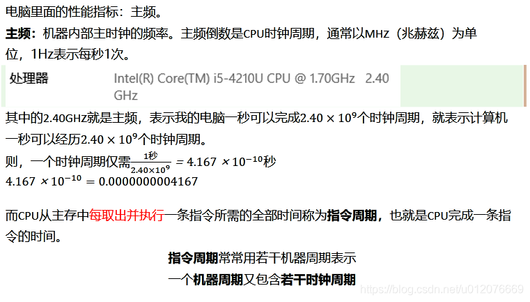

性能

> 全方位评估标准：**SPEC**（Standard Performance Evaluation Corporation）。

性能指标：响应时间和吞吐量。

**响应时间**（Response time）或者叫执行时间（Execution time）：执行一个程序需要花费的时间。计算机的计时单位为CPU 时钟
**吞吐率**（Throughput）或者带宽（Bandwidth）：在一定的时间范围内能处理多少条程序指令。

由于单次程序执行的时间在计算机中受众多因素影响包括：cpu是否超频、降频运行、多程序并发执行等等，因此通过CPU时钟来衡量程序的性能。

程序的 CPU 执行时间 = CPU 时钟周期数 × 时钟周期时间 = 指令数 × **每条指令的平均时钟周期数**（Cycles Per Instruction，简称 CPI） ×  时钟周期时间（Clock Cycle Time）

时钟周期：

> CPU主频（Frequency/Clock Rate）：CPU 在 1 秒时间内，可以执行的简单指令的数量，通常以MHZ（兆赫兹）为单位。1HZ表示每秒1次。
>
> CPU 时钟周期(Clock Cycle)：CPU主频的倒数
>
> 主频越高cpu的时钟周期时间越小
>
> CPU的主频，即CPU内核工作的时钟频率（CPU Clock Speed）。CPU的主频表示在CPU内数字脉冲信号震荡的速度
>
> 

时钟周期时间：计算机主频，这个取决于计算机硬件。

每条指令的平均时钟周期数 CPI：一条指令到底需要多少 CPU Cycle。现代的 CPU 通过流水线技术（Pipeline），让一条指令需要的 CPU Cycle 尽可能地少

指令数：执行我们的程序到底需要多少条指令、用哪些指令。编译器将相同的代码编译成计算机指令时候，有各种不同的表示方式。

> 衡量 CPU 乃至计算机整机的性能：用 SPEC 这样的跑分程序，从多个不同的实际应用场景

**指令周期**（Instruction Cycle）:指“**Fetch - Decode - Execute**”这个循环过程

**CPU 周期**（Machine Cycle）：把从内存里面读取一条指令的最短时间

**时钟周期** (Clock Cycle)：CPU主频的倒数

**CPU主频**（Frequency/Clock Rate）：CPU 在 1 秒时间内，可以执行的简单指令的数量