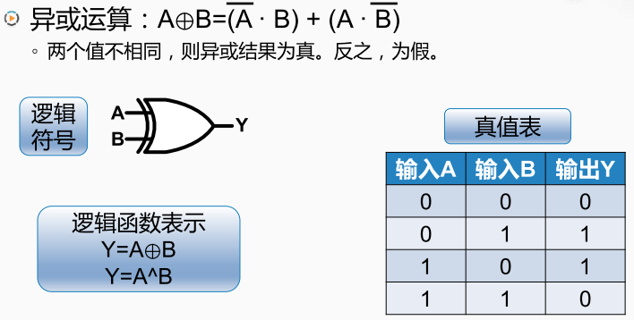

异或门

> 只有当两个操作数的值如果不相同则结果为真，也就是1， 如果两个操作数的值相同，则结果为假，也就是0， 

可以用与和非的操作组合出来，a的非和b进行与，即当a等于零时，a的非为1，而且b也等于1时， 第一个括号`(!A + B)`中的表达式就为1，而当a等于1，b等于0时， 第二个括号中的表达式就会为1，中间进行或`(+)`， 也就是这两个表达式只要其中一个为1，结果就是1。而当a和b都等于0，或者a和b都等1时，这两个表达式的结果都是0。取或之后最终的结果也还是0。 
