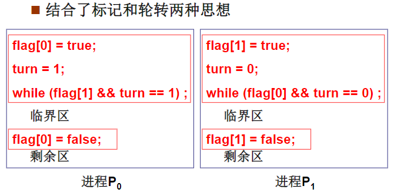

## 忙等互斥

忙等互斥：先检查是否能够进入临界区，若不允许，则该进程将原地等待，直到允许为止。进入临界区的进程后立即屏蔽所有中断，并在离开临界区之前重启中断。

> CPU只有发生时钟中断或其他中断时才会进行进程切换


### 严格轮询

问题：进程0完成后不能再次进入，尽管进程1不在临界区

进程0的代码

```c
while(TRUE){
    while(turn != 0){
        /**进入关键区域**/
        critical_region();
        turn = 1;
        /**离开关键区域**/
        noncritical_region();
    }
}
```

进程1的代码

```c
while(TRUE){
    while(turn != 1){
        critical_region();
        turn = 0;
        noncritical_region();
    }
}
```


> 忙等待(busy waiting)：连续检查一个变量直到某个值出现为止。这种方式比较浪费CPU，只能用于等待时间非常短的场景下。
>
> 自旋锁 (spinlock)：用于忙等待的锁


### Peterson 解法



Peterson 算法的正确性

满足互斥进入：如果两个进程都进入，则flag[0] = flag[1] = true, turn =1=0，矛盾

满足有空让进：如果进程P1不在临界区，则flag[1]=false, 或者 turn=0, P0都能进入

满足有限等待：P0要求进入，flag[0]=true；后面的P1不可能一直进入，因为P1执行一次就会让turn=0

### TSL指令

测试并加锁（test and set lock），将一个内存地址lock的数据读到寄存器RX中，然后在该内存地址上存储一个非零值。读写指令是原子的，在这个指令结束之前其他处理器均不允许访问内存。执行TSL指令的CPU将会锁住地址总线，用来禁止其他CPU在这个指令结束之前访问内存。

```assembly
 TSL RX,LOCK
```


> 锁住地址总线和禁用中断不一样。禁用中断并不能保证一个处理器在读写操作之间另一个处理器对内存的读写。即在处理器1上屏蔽中断对处理器 2 没有影响。锁住地址总线能控制其他处理器远离内存，直到释放锁。


[[互斥量]]