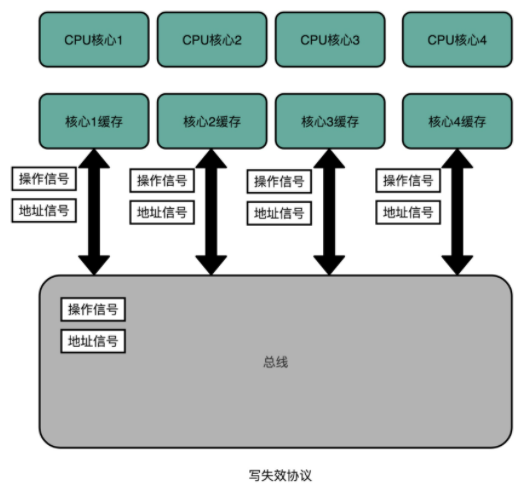
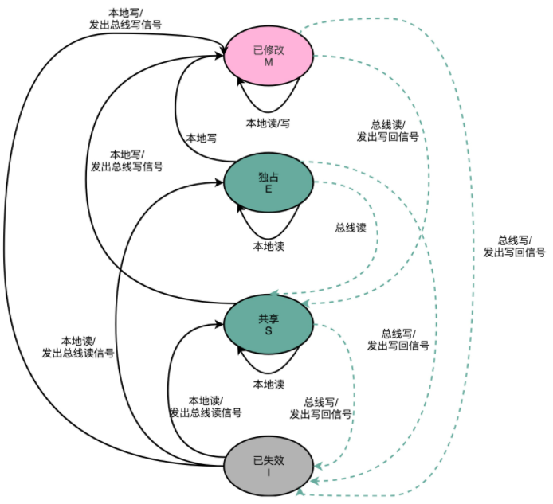

总线嗅探机制和 MESI 协议

**总线嗅探**（Bus Snooping），将所有的读写请求都通过总线（Bus）广播给所有的 CPU 核心，然后让各个核心去“嗅探”这些请求，再根据本地的情况进行响应。总线嗅探机制，其实还可以分成很多种不同的缓存一致性协议。常用的包括MESI。

MESI 协议，是一种叫作**写失效**（Write Invalidate）的协议。在写失效协议里，只有一个 CPU 核心负责写入数据，其他的核心，只是同步读取到这个写入。在这个 CPU 核心写入 Cache 之后，它会去广播一个“失效”请求告诉所有其他的 CPU 核心。其他的 CPU 核心，只是去判断自己是否也有一个“失效”版本的 Cache Block，然后把这个也标记成失效的就好了。

MESI 协议分别是：

- M：代表已修改（Modified），即“脏”的 Cache Block。Cache Block 里面的数据已经被更新，但是还没有写回到主内存里面

- E：代表独占（Exclusive），只对应的 Cache Line 只加载到了当前 CPU 核所拥有的 Cache 里。如果要向独占的 Cache Block 写入数据，我们可以自由地写入数据，而不需要告知其他 CPU 核。

  > 在独占状态下的数据，如果收到了一个来自于总线的读取对应缓存的请求，它就会变成共享状态。

- S：代表共享（Shared），同样的数据在多个 CPU 核心的 Cache 里都有。因此当要更新 Cache 里面的数据的时候，不能直接修改，而是要先向所有的其他 CPU 核心广播一个请求，要求先把其他 CPU 核心里面的 Cache，都变成无效的状态，然后再更新当前 Cache 里面的数据。

  > 这个广播操作，一般叫作 RFO（Request For Ownership），也就是获取当前对应 Cache Block 数据的所有权。

- I：代表已失效（Invalidated），即 是否有效位设置为0，Cache Block 里面的数据已经失效。

