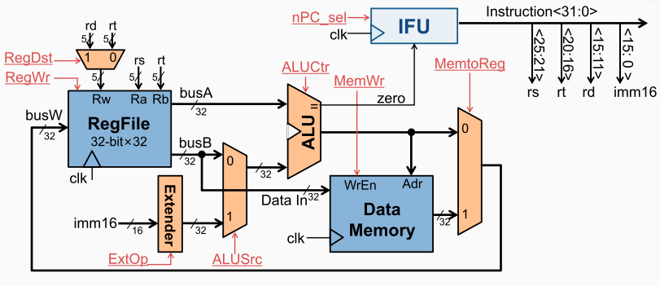
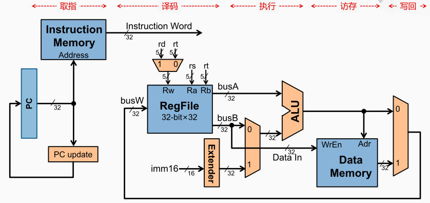

计算机执行指令的过程

处理器执行过程
冯·诺伊曼型计算机的CPU，其工作都可以分为5个：取指令、指令译码、执行指令、访存取数、结果写回。

1 、取指（ Instruction Fetch，IF） 从存储器取指令，更新 PC
2 、译码（ Instruction Decode，ID） 指令译码，从寄存器堆读出寄存器的值
3 、执行（ Execute，EX）运算指令：进行算术逻辑运算。访存指令：计算存储器的地址
4 、访存（ Memory，MEM）Load 指令：从存储器读数据。Store 指令：将数据写入存储器
5 、回写（ Writeback，WB） 将数据写入寄存器堆

[[加法指令的执行过程]]

