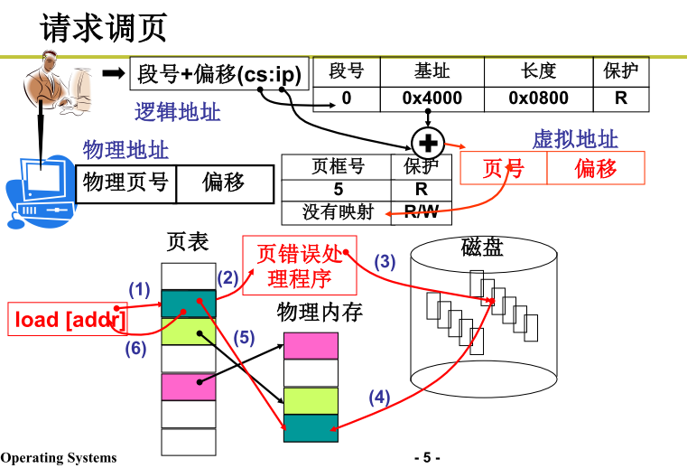
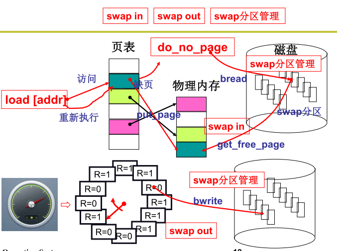
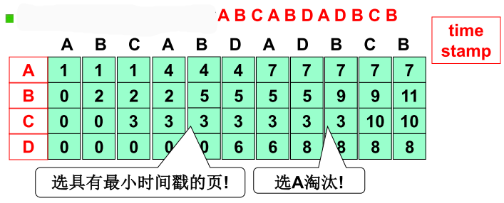
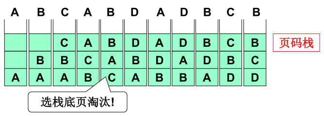
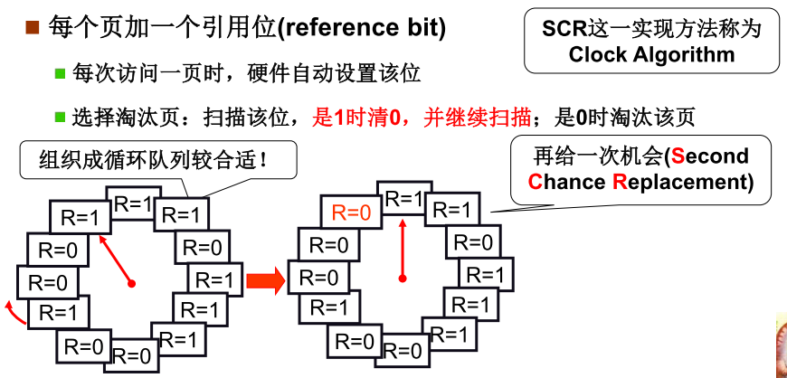
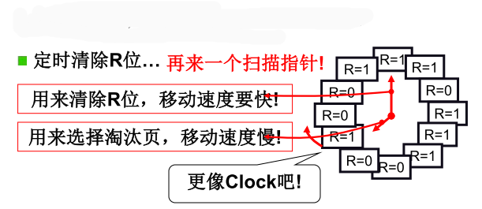

操作系统通过页面的换入换出管理虚拟内存。

## 页面的换入换出

当程序发起内存页面请求时如果内存中不存在对应的页，则会触发缺页中断。然后通过页错误处理程序从磁盘调入页面至物理内存。最后建立物理内存页框号与虚拟内存页号的映射关系。如果空间不够时，操作系统会选择一个页面进行换出从而为新进来的页面腾出空间。

> 此时如果要换出的页面在内存中已经被修改，那么必须将其写到磁盘。如果页面没有被修改过则不需要进行重写可以直接使用调入的页面覆盖需要移除的页面。

**先进先出算法FIFO（First-In,First-Out）**：由操作系统维护一个所有在当前内存中的页面的链表，最早进入的放在表头，最新进入的页面放在表尾。在发生缺页异常时，会把头部的页移除并且把新的页添加到表尾。

**MIN 算法**：选择距离将来被使用中间指令数最多的页面进行淘汰（比如A页面距离在接下来的2个指令将被使用，B页面在接下来的200个指令后将被使用则优先淘汰页面B），最优方案

**最近最久未使用算法**（Least Recently Used，LRU）：如果一个数据在最近一段时间没有被访问到，那么可以认为在将来它被访问的可能性也很小。因此，当空间满时，最久没有访问的数据最先被置换（淘汰）。Redis，Memcached，java.util.LinkedHashMap。

实现过程：

每页维护一个时间戳：当页面被访问时为每个页面设置一个时间戳用于记录访问时间，在页面换出时选择时间最小的那个页面进行换出。缺点：每次地址访问都需要修改时间戳，需维护一个全局时钟，需找到最小值。相对实现代太大

维护一个页码栈：首先建立一个栈，访问页面时先检查是否已经存在，如果存在则将该页面从原来的位置设置到栈顶。如果不存在则淘汰栈底页面，再压栈新页面到栈顶。缺点：每次地址访问都需要修改栈(修改10次左右栈指针) 实现代价仍然较大 ⇒ LRU准确实现用的少

**最近最少使用算法**（Least Frequently Used， LFU ）：如果一个数据在最近一段时间很少被访问到，那么可以认为在将来它被访问的可能性也很小。因此，当空间满时，最小频率访问的数据最先被淘汰。

实现过程：为每个页面设置一个计数器。在每个时钟中断时，操作系统会浏览内存中的所有页，会将每个页面的R位（0或1）加到它的计数器上。当缺页异常出现时，则置换计数器值最小的页面。

**第二次机会算法(second chance)**：为每个页面设置一个引用位R，每次访问该页时设置R位为1。当需要淘汰页面时扫描所有页面的R位，如果R位是0则此页面最老且没有被使用可以被换出。 如果R位是1，则清除此位且此页面被放在链表的尾部，然后继续搜索。 环

缺点：如果缺页比较少则可能导致所有页面的R位都被设置为1，则此时将扫描全部的页面后再次回到原来指针所指向的页面，并淘汰指向的页面。此时类似于FIFO

为体现最近的概念，可以设置两个快慢指针。快指针清除R位，慢指针指向需要淘汰的页

**老化（aging）算法**：首先在R位被添加进来之前先把计数器右移一位；其次，R位被添加到最左边的位而不是最右边的位。当缺页异常出现时，将置换（就是移除）计数器值最小的页面。（短暂的时间窗口）

现实中数据的特点：局部性、稀疏性、低秩性
