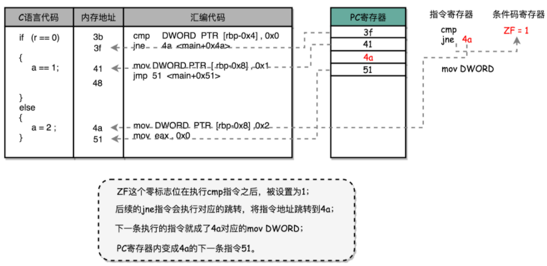
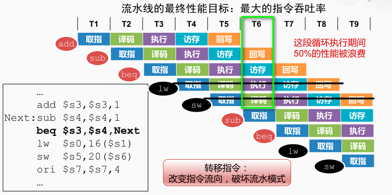

**控制冒险**（Control Harzard）

> 在结构冒险和数据冒险中，所有的流水线停顿操作都要从**指令执行阶段**开始。取指令（IF）和指令译码（ID）的阶段不需要停顿，是基于基于一个假设，即所有的指令代码都是顺序加载执行的。也就是说在实际执行的代码中如果遇到if…else 或 for/while 就会不成立。

> 高级语言中的 if…else，其实是变成了一条 cmp 指令和一条 jmp 指令。
>
> cmp 指令是在进行对应的比较执行结果放到了**条件码寄存器**里面。
>
> jmp 指令则是根据条件码寄存器当中的标志位，来决定是否进行跳转以及跳转到什么地址。条件跳转指令也是在 ALU 层面执行的，而不是在控制器里面执行的。

>当执行了转移指令，并确实发生转移时，产生如下的开销，称为“转移开销”
>① 将按顺序预取的指令废除（即“排空流水线”）
>② 从转移目标地址重新取指令
>
>
>
>转移开销的构成
>① “要不要转移？”：转移条件判定引起的开销
>② “转移到哪里？”：生成目标地址引起的开销

缩短分支延迟

将条件跳转指令的条件判断、地址跳转，都提前到指令译码阶段进行，而不需要放在指令执行阶段。

无论是 opcode，还是对应的条件码寄存器，还是我们跳转的地址，都是在指令译码（ID）的阶段就能获得的。而对应的条件码比较的电路，只要是简单的逻辑门电路就可以了，并不需要一个完整而复杂的 ALU。

条件跳转指令其实进行了两种电路操作。

第一种，是进行条件比较。这个条件比较，需要的输入是，根据指令的 opcode，就能确认的条件码寄存器。

第二种，是进行实际的跳转，也就是把要跳转的地址信息写入到 PC 寄存器。

[[分支预测]]

[[嵌套循环]]
