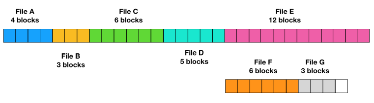
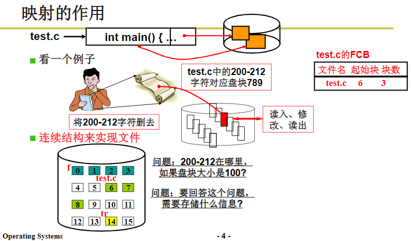
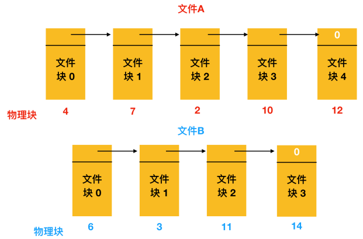
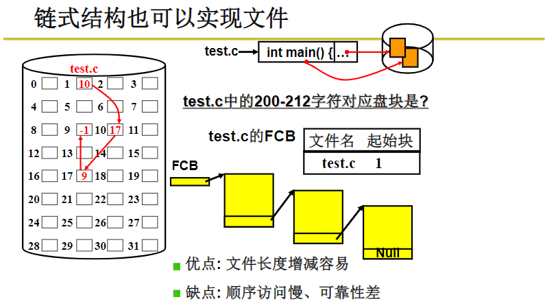
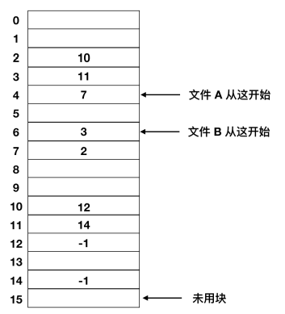
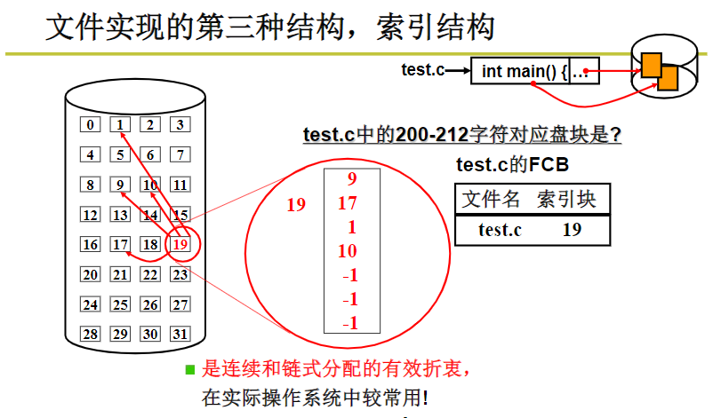

文件的实现
最重要的问题是记录各个文 件分别用到了哪些磁盘块。分配背后的主要思想是有效利用文件空间和快速访问文件，主要：连续分配、链表分配、索引分配等三种方案

## 连续分配

把每个文件作为一连串连续数据块存储在磁盘上。每个文件都会在新的文件块开始写，所以如果文件A只占用了 3又1/2个块，那么最后一个块 
的部分内存会被浪费。 缺点容易产生磁盘碎片造成空间浪费。

## 链表分配

为每个文件构造磁盘块链表，每个块的第一个字作为指向下一块的指针，块的其他部分存放数据。缺点随机读相对比较困难，且指针会占用部分空间。

## 索引分配

取出每个磁盘块的指针字，把它们放在内存的一个表（文件分配表(File Application Table,FAT) ）中。文件A依次使用了磁盘块地址4、7、2、10、12,文件B使用了6、3、11和14。缺点必须要把整个链表放在内存。

