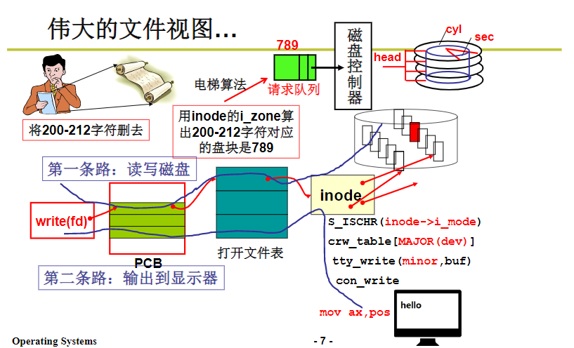
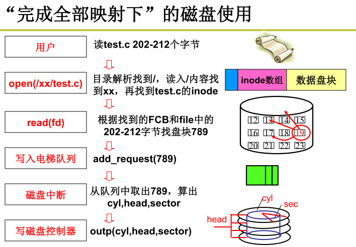

文件读写过程

通过文件名找到对应文件描述符，在字符设备接口中通过文件描述符找到对应的inode信息。

## 读文件
1. 进程调用库函数向内核发起读文件请求；
2. 内核检查进程的文件描述符定位到虚拟文件系统的已打开文件列表表项；
3. 调用该文件可用的系统调用函数read()，然后通过文件表项链接到目录项模块，根据传入的文件路径，在目录项模块中检索，找到该文件的inode；
4. 在inode中，通过文件内容偏移量计算出要读取的页，并找到文件对应的address_space；
5. 通过addres_space访问该文件的页缓存树，查找对应的页缓存(Page Cache)结点：
（1）如果页缓存命中，那么直接返回文件内容；
（2）如果页缓存缺失，那么产生一个页缺失异常，创建一个页缓存页，同时通过inode找到文件该页的磁盘地址，读取相应的页填充该缓存页；再次访问address_space并找到对应的页缓存结点。

## 写文件

前4步和读文件一致，在address_space中查询对应页的页缓存是否存在：

5. 如果页缓存命中，直接把文件内容修改更新在页缓存的页中。未落盘。
6. 如果页缓存缺失，则产生一个页缺失异常，创建一个页缓存页，同时通过inode找到文件该页的磁盘地址，读取相应的页填充该缓存页。
7. 将脏页写入磁盘。一个页缓存中的页如果被修改，那么会被标记成脏页。
	* 手动调用sync()或者fsync()系统调用把脏页写回
	* pdflush进程会定时把脏页写回到磁盘

[[HDD磁盘IO过程]]

[[Page Cache]]

[[Linux IO]]