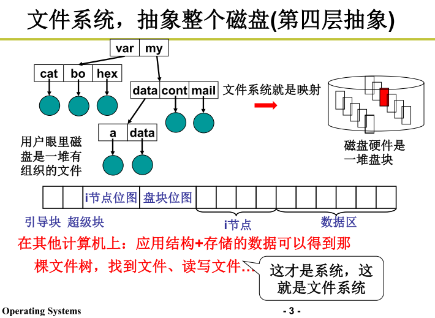

## 文件系统布局
每个磁盘能够划分出一到多个分区，且每个分区都可以有独立的文件系统。磁盘的0号分区称为主引导记录(Master Boot Record, MBR)，用来引导(boot)计算机。
在MBR的结尾是分区表(partition table)，每个分区表给出每个分区由开始到结束的地址。

**引导块**：MBR从活动分区，读入引导块(boot block)并执行。引导块中的程序将加载分区中的操作系统。

**超级块**: 记录inode位图、盘块位图、文件系统的大小等。

**inode位图**: 哪些inode空闲，哪些被占用

**盘块位图:** 哪些盘块是空闲的，硬盘大小不同这个位图的大小也不同

fd, file descriptor  文件描述符（本质上是个数字）是open系统调用内部由操作系统自动分配的。linux中文件描述符表是个数组，fd是index，文件表指针是value

File Control Block(简称FCB)是操作系统为每个文件建立的唯一数据结构。一个文件由：FCB和文件数据组成

目录文件便是由许多的FCB汇集在一起所形成的文件，至少包含两个文件：当前目录（即自身）“.”和其父目录“..”
> 文件目录的基本功能是将文件名转换成该文件在磁盘上的物理位置

**inode（index node）索引节点**：每个索引节点都存储对象数据的属性和磁盘块位置。
-   Linux系统中，FCB中的文件名和其他管理信息分开，其他信息单独构成一个数据结构，即索引节点inode，这些inode被集中存放在磁盘上的inode区。
    
-   索引节点位置由inode标号标识，所以目录项中仅有文件名和inode标号，称为基本目录项

> linux中可以使用 ls -ali 查看。

[[Linux的文件系统]]

[[文件的实现]]

[[目录的实现]]

[[文件的读写过程]]

