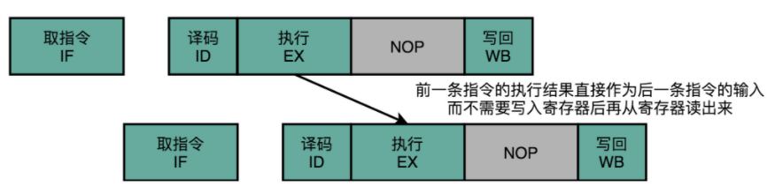

**操作数前推**

```assembly
add $t0, $s2,$s1
add $s2, $s1,$t0
```

1. 第一条指令，把 s1 和 s2 寄存器里面的数据相加，存入到 t0 这个寄存器里面。
2. 第二条指令，把 s1 和 t0 寄存器里面的数据相加，存入到 s2 这个寄存器里面。

后一条的 add 指令，依赖寄存器 t0 里的值。而 t0 里面的值，又来自于前一条指令的计算结果。所以后一条指令，需要等待前一条指令的数据写回阶段完成之后，才能执行。因此在第二条指令的指令执行阶段开始前需要先完成第一条指令的结果写回操作。


由于第二条执行在指令执行阶段需要将第一条指令在指令回写阶段写入的数据读取出来，因此可以直接第一条指令的执行阶段完成之后，直接将结果数据传输给到下一条指令的 ALU。然后，下一条指令不需要再插入两个 NOP 阶段，就可以继续正常走到执行阶段。



这样的解决方案，我们就叫作**操作数前推**（Operand Forwarding），或者操作数旁路（Operand Bypassing）。在第 1 条指令的执行结果，直接“转发”给了第 2 条指令的 ALU 作为输入。在硬件层面制造一条旁路，让一条指令的计算结果。

sub $t0,$s1,$s2

add $s3,$t0,$s4

