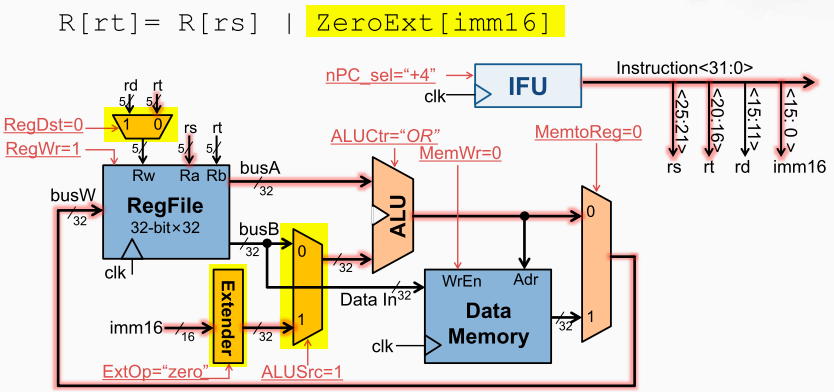
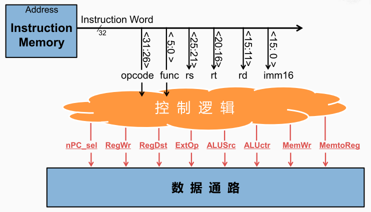

构建数据通路

> 根据指令需求，连接组件，建立数据通路

取指令：把PC寄存器的输出就作为指令的地址，连接到指令存储器，而指令存储器则会根据地址的输入选中对应的存储单元，并将其内容输出

R型的加法和减法指令：主要操作是先用rs 和rt，这两个5位信号，访问寄存器堆获得两个寄存器的内容，并对他们执行相应的运算。然后在下一个时钟上升沿到来的时候，如果寄存器堆的写使能信号是有效的（RegWr=1）寄存器堆采样busW信号上的内容，从而实现将rs和rt的运算结果写入rd。

I型的或操作：主要操作是由rs所指定的寄存器的内容取或立即数进行零扩展后的值，而计算后的数据也要保存在rt所指向的寄存器中。 因此在原有R型算术运算指令的电路基础上，在rt和rd后面增加一个多选器，在busB后面新增一个多选器，且多选器的另一个输入接入一个立即数的增加一个零扩展部件。

Load指令：Load指令主要用于对数据存储器进行访问，而访存的地址是由rs所指定的寄存器的内容加上立即数进行符号扩展后的值，而且访存得到的数据也要保存在rt所指向的寄存器当中。 

因此扩充零扩展器为多功能扩展部件，其次通过ALU运算后的结果应该作为地址用于访问存储器从而获得数据，所以在ALU后新增一个数据存储器，然后在ALU的输出和存储器的输出间通过多选器连接busW。

Store指令：将rt所指定的寄存器当中的内容存放到数据存储器当中去。 在目前的数据通路中，rt所指定的寄存器的内容会从busB信号上出来，因此就需要将这个信号连接到数据存储器的数据输入端。因此busB上的输出结合存储器的写使能信号，就能完成数据写入。

分支指令

最终的数据通路

控制逻辑与数据通路

[[基础组件]]
