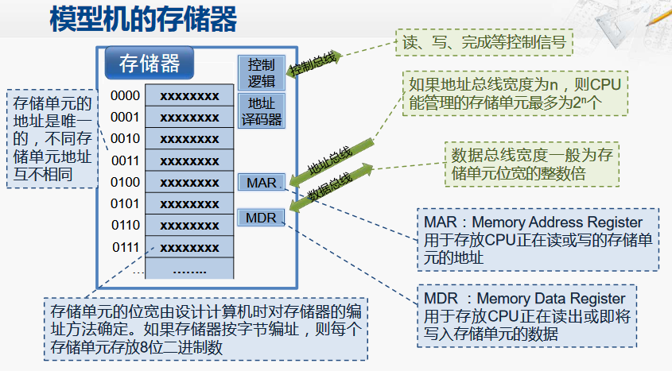

存储器

存储器按**字节**编制，每个存储单元存放八位的二进制数。如果CPU要想访问某个存储单元，则必须通过地址总线给出存储单元的地址。

控制总线：用于存储器与CPU之间控制指令的交互

地址总线：CPU向存储器发送需要获取对应存储单元数据的地址，如果地址总线的宽度为N，则CPU能管理的存储单元数最多为2的N次方个

数据总线：用于存储器与CPU之间的数据交互

CPU发来的地址将会存放在存储器的地址寄存器（MAR）中。

CPU要读写的数据则会存放在存储器的数据寄存器（MDR）中，

控制总线与存储器当中的控制逻辑相连，用于接收来自于CPU的读写信号 或者向CPU反馈传输已经完成的信号。 

