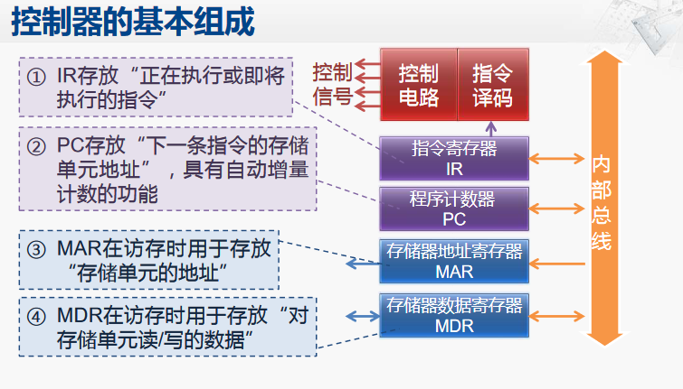
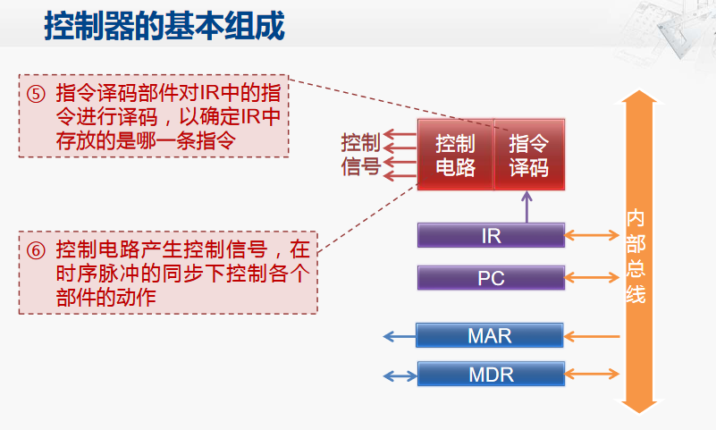

CPU中的控制器

控制器是用于控制计算机各个部件完成<u>取指令、分析指令、执行指令</u>等功能。 主要包括指令寄存器、程序计数器、存储器地址寄存器、存储器数据寄存器、指令译码部件、控制电路。

指令寄存器（IR）：用于存放正在执行的指令。 

程序计数器PC， 用于生成和存放下一条指令的存储单元地址。

指令译码部件，用于对指令寄存器（IR）当中的指令进行译码。

控制电路，用于将指令产生对应的控制信号， 然后在持续脉冲的同步下去控制CPU当中各个控制部件的动作。

> CPU中也包含访存相关的寄存器，MAR寄存器用于存放访问存储器的地址； MDR 寄存器用于存放写到存储器或者从存储器读回的数据中。 

