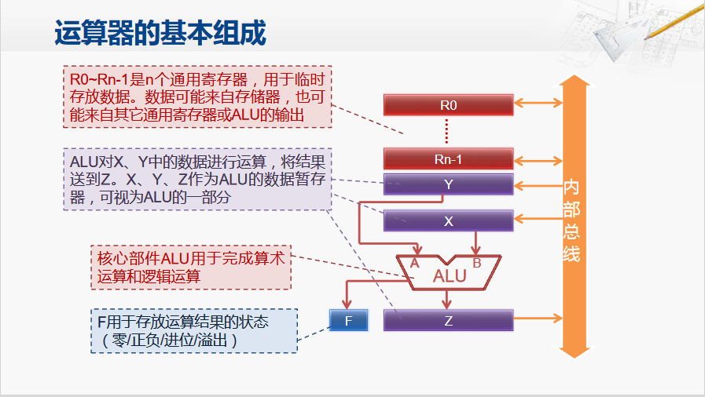
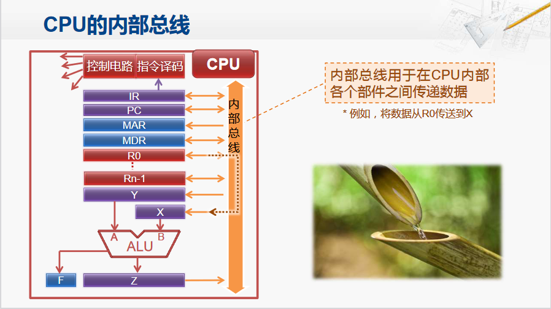

CPU的运算器

**算数逻辑单元ALU**，用于完成算数运算和逻辑运算。包含两个输入，一个输出，以及标记寄存器F。

**通用寄存器**：用于存放提前从存储器中取出来的数据。通常编号为$R_0$到$R_{N-1}$，

**内部总线**：用于通用寄存器与ALU、通用寄存器之间传递数据

内部总线的工作原理

例如需要将数据从寄存器R0传递数据到X，R0与X可以理解为两个蓄水池而内部总线则是连接两个蓄水池的管道。

