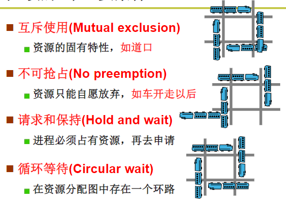

## 死锁

死锁（Dead Lock）：两个进程独占性的访问某个资源，从而等待另外一个资源的执行结果，会导致两个进程都被阻塞，并且两个进程都不会释放各自的资源

产生死锁的必要条件：
- 互斥条件：进程要求对所分配的资源进行排它性控制，即在一段时间内某资源仅为一进程所占用。

- 保持和等待条件：当进程因请求资源而阻塞时，对已获得的资源保持不放。

- 不可抢占条件：进程已获得的资源在未使用完之前，不能剥夺，只能在使用完时由自己释放。

- 循环等待：死锁发生时系统中一定有两个或者两个以上的进程组成一个循环，循环中的每个进程都在等待下一个进程释放的资源。

死锁预防，破坏产生死锁的四个条件中的一个：
-   破坏互斥条件： 打破竞争资源的独占性，支持多个线程共享。不适用

-   破坏保持和等待条件：阻止持有资源的进程请求其他资源。比如开始执行前请求全部的资源

-   破坏不可抢占条件： 使用虚拟化技术解决

-   破坏循环等待条件： 对资源进行编号，进程在对资源提出请求时必须按照资源顺序

两阶段提交(two-phase locking) ：一阶段是进程尝试一次锁定它需要的所有记录。如果成功后，才会开始第二阶段，第二阶段是执行更新并释放锁。
第一阶段并不做真正有意义的工作。如果在第一阶段某个进程所需要的记录已经被加锁，那么该进程会释放所有锁定的记录并重新开始第一阶段。

[[死锁避免]]

[[死锁检测与恢复]]