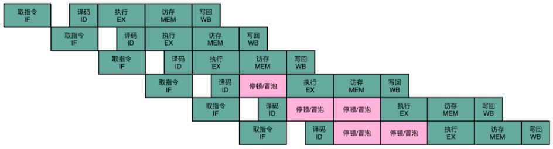

流水线停顿：如果发现了后面执行的指令，会对前面执行的指令有数据层面的依赖关系，那最简单的办法就是“**再等等**”。
在进行指令译码的时候，会拿到对应指令所需要访问的寄存器和内存地址。此时能够判断出来，该指令是否会触发数据冒险。
如果会触发数据冒险，可以让整个流水线停顿一个或者多个周期。

> 由于时钟信号会不停地在 0 和 1 之前自动切换，因此可以将停顿实施为一个NOP，即什么都不做的操作。
