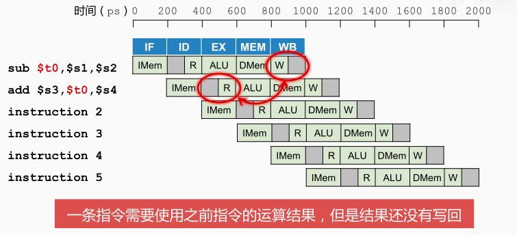

流水线设计需要解决的三大冒险：**结构冒险**（Structural Hazard）、**数据冒险**（Data Hazard）以及**控制冒险**（Control Hazard）。

冒险：阻止下一条指令在下一个时钟周期开始执行

1. 结构冒险：所需的硬件部件正在为之前的指令工作。比如不同指令同时需要读写寄存器

> 如果读寄存器和写寄存器同时发生，由于寄存器堆的读写速度较快，假设读或写寄存器的延迟为 100ps ，而 ALU 等部件的延迟为 200ps，所以前半个时钟周期写，后半个时钟周期读，并且设置独立的读写口

2. 数据冒险：需要等待之前的指令完成数据的读写

3. 控制冒险：需要根据之前指令的结果决定下一步的行为

[[控制冒险]]

[[数据冒险]]

[[结构冒险]]

[[指令的执行过程]]