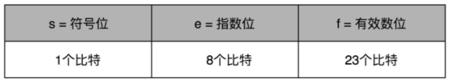
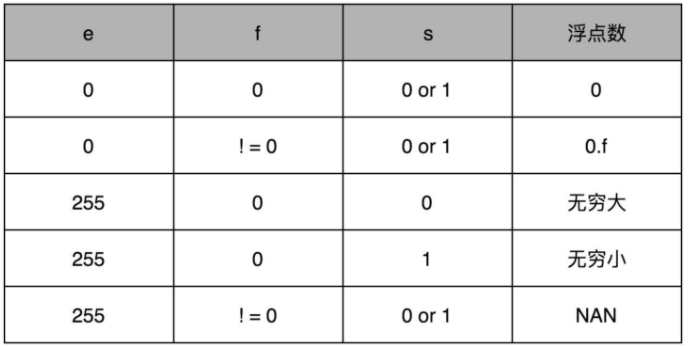

## 浮点数的表示法

定点数：小数点固定在某一位的方式，比如BCD编码的实数。

浮点数：小数点不固定的方式，包括单精度和双精度浮点数。

基于 IEEE-754 标准定义了用 32 比特表示单精度的浮点数（float）以及用 64 比特表示双精度的浮点数（double）。单精度类型的科学计数法

$(−1)^s×1.f×2^e$

> e表示二进制数在满足754表达式时偏移的位数，向右偏移用负数表示，向左偏移用整数表示。e 通过负数可以表示很小的数，

0 和一些特殊的数表示法

[[浮点数加法]]

[[十进制转二进制]]

[[二进制转化为十进制]]