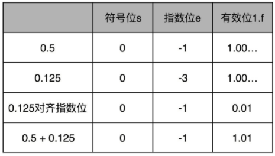

### 浮点数加法

> 先将浮点数转为二进制
> 然后再将二进制转为IEEE-754表示法
> 最后再对齐指数位，并计算有效位的加法

比如 0.5，表示成浮点数，对应的指数位是 -1（向左偏移了移位），有效位是 00…（f 前默认有一个 1）。0.125 表示成浮点数，对应的指数位是 -3，有效位也还是 00…（后面全是 0，记住 f 前默认有一个 1）。

首先要把两个的指数位对齐，即把指数位都统一成两个其中较大的 -1。对应的有效位 1.00…也要对应右移两位，即 f 前面的 1变成 0.01。

然后将有效位 1.f相加，就变成了有效位 1.01，而指数位是 -1。因此结果为：

> 指数位较小的数，需要在有效位进行右移，因此导致有效位在加法发生之前，就**丢失精度**。
> 两个相加数的指数位差的越大，位移的位数越大，可能丢失的精度也就越大。