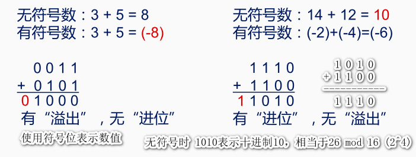
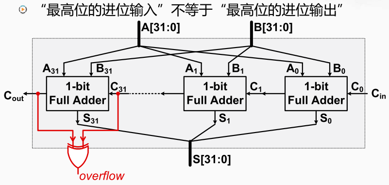

1110加上1100送到 四位的加法器中运算的结果1010 ，同时有一个进位1。 

如果当作无符号数进行运算则1110是14，1100是12。 此时如果带上进位一起考虑那就是正确的运算结果26。 如果不带进位则是为10 。但因为四位的二进制位只能表示小于16的数， 所以无符号数的的运算结果可以默认为对结果进行模16的运算。 那只看四位的话结果是10，相当于26 模16的值。所以这也是正确的。

如果当做有符号数来说相当于-2加上-4 而这四位的结果就是-6 ，这个运算也是正确的。 如果是负数则这里的二进制是补码。

进位判断，最高位的全加器的进位输出就是整个加法器的进位。

溢出判断，最高位的全加器的进位输入不等于它的进位输出的时候。 

对于一个加法器的硬件实现对于有符号数和无符号数的处理都是一样的都是通过同样的硬件逻辑进行运算，产生相同的结果。 至于参与运算的数到底是有符号数还是无符号数，取决于编程人员如何去看待它。 

MIPS处理溢出的方式 

MIPS提供了两种不同的指令`add` 和 `addu`。如果将操作数看作有符号数需要处理溢出， 则需要使用`add`和`addi`这样的指令。 当发生溢出时会产生异常。即检查加法器产生的overflow的信号。 如果overflow信号有效，控制电路就会当做一个异常的情况进行处理。 如果将操作数看作无符号数则需要使用这两条指令，`addu`和`addiu`。此时控制电路不会检查加法器输出的overflow信号。 

x86处理溢出的方式

x86的运算指令，如果产生了溢出，并不会直接由控制电路检查到并进行处理。 而是将加法器产生的溢出信号传送到了标志寄存器。 如果发生溢出，则会致标志寄存器当中的OF位为1。如果没有发生溢出，则致OF位为0。标志寄存器的第十一位。 