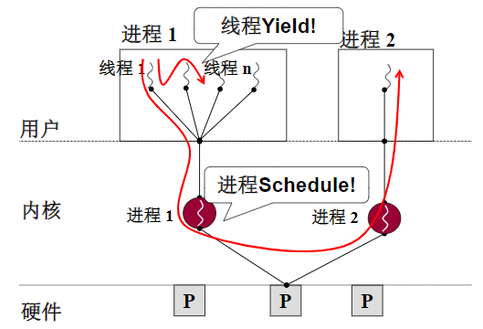
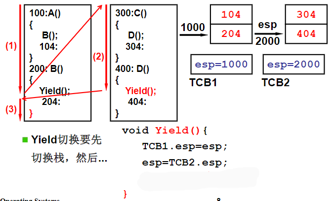

用户级线程

1. 线程表保存在用户空间内，且线程对内核透明
2. 线程切换时只需要切换程序计数器、堆栈指针等信息
3. 线程阻塞时只能切换到当前进程中的其他线程
> 线程表(thread table)，用来跟踪该进程中的线程，包括程序计数器、堆栈指针、寄存器和状态。

用户空间实现线程的优势：

1. 用户空间内部的线程切换比内核空间的进程切换效率要高

> 线程完成时或者是在调用pthread.yield时，必要时会进行线程切换。
> 此时线程的信息会被保存在运行时环境所提供的线程表中，由线程调度程序来选择另外一个需要运行的线程。
> 不需要切换到内核，也就不需要上下文切换，也不需要对内存高速缓存进行刷新，因为线程调度非常便捷，因此效率比较高。

2. 在用户空间内每个进程可以定制不同的调度算法

用户级线程切换

