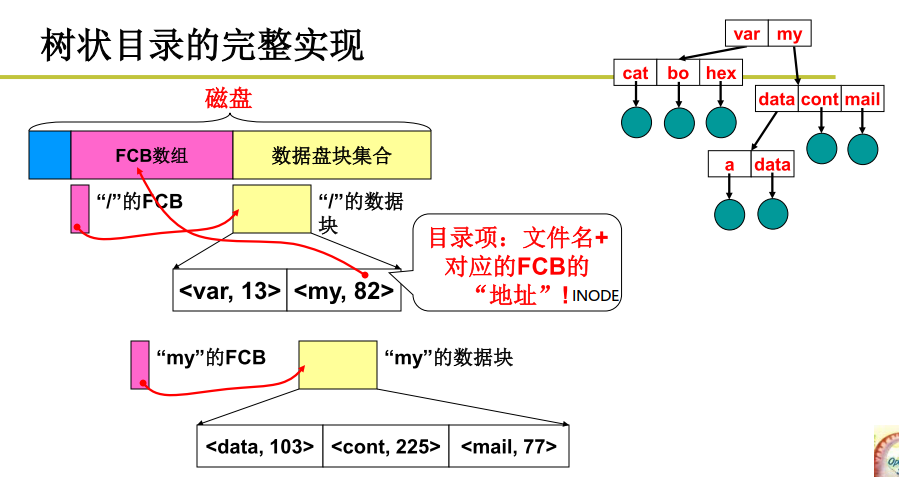

## 目录的实现

目录系统的主要功能就是将文件的ASCII码的名称映射到具体的文件描述。
首先打开根目录的fcb
然后从根目录的fcb中定位到下一级的目录对应的fcb数组的索引
最后依此类推直到定位到具体文件描述符

> 所有的文件的fcb都存放在磁盘上，根目录的FCB存放在固定的位置

## INODE
inode 整数，用于表示该目录对应的文件控制块FCB在磁盘的inode块中的索引。该文件控制块列出了文件映射的磁盘块集合。当文件打开时，其inode会被加载到内存中。

> 小文件直接使用顺序盘块号，中等文件采用一阶间接索引，二阶间接索引，大文件采用三阶间接索引

inode 具体包含以下信息：

- 权限 (read/write/excute)；
- 拥有者与群组 (owner/group)；
- 容量；
- 建立或状态改变的时间 (ctime)；
- 最近读取时间 (atime)；
- 最近修改时间 (mtime)；
- 定义文件特性的旗标 (flag)，如 SetUID...；
- 该文件真正内容的指向 (pointer)。

inode 具有以下特点：
- 每个 inode 大小均固定为 128 bytes (新的 ext4 与 xfs 可设定到 256 bytes)；
- 每个文件都仅会占用一个 inode。
