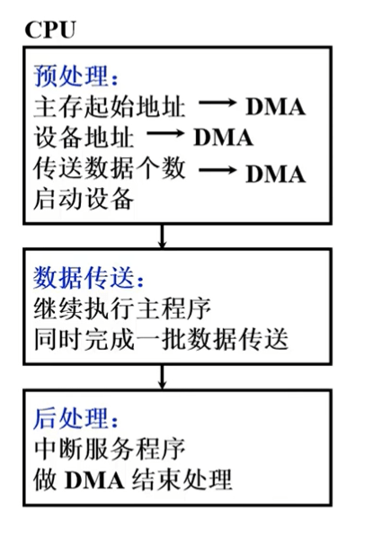
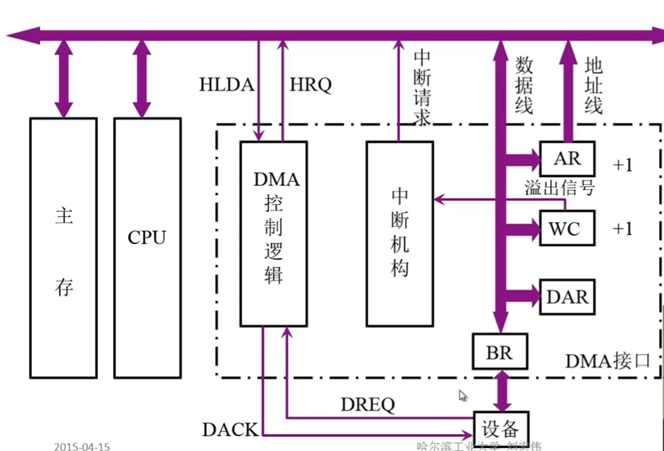

Direct Memory Access (DMA) 直接存储器访问，允许`不同速度的硬件装置来沟通`，而不需要依赖于 CPU 的大量中断负载。其目的是为了释放CPU资源。CPU只需要初始化DMA控制器，并处理DMA请求中断和完成中断不需要参与整个I/O过程。

> 在实现DMA传输时，是由DMA控制器直接掌管总线，因此在DMA传输前，需要CPU把总线控制权交给DMA控制器，而在结束DMA传输后，DMA控制器应立即把总线控制权再交回给CPU。

## 预处理

1. 给DMA控制逻辑指明数据传送方向是输入(写主存)还是输出(读主存)。

2. 向DMA设备地址寄存器送入设备号，并启动设备。

3. 向DMA主存地址寄存器送入交换数据的主存起始地址。

4. 对字计数器赋予交换数据的个数。

## 数据传送

> AR：地址寄存器
> WC：计数器
> DAR：设备地址寄存器
> BR：数据缓存器
> HRQ：总线使用请求信号， DMA控制器向CPU发出的要求接管总线的请求信号。
> HLDA：应答信号， CPU向DMA控制器发出的允许接管总线的应答信号。
> DREQ：设备请求信号，外设向DMA控制器（DMAC，DMA Controller）提出的要进行DMA操作的申请信号。
> DACK：控制信号，DMA控制器向发出DRQ信号的外设的回应，表示收到请求和正在进行处理。
>
> 

1. 设备向BR（数据缓冲器）发送（或BR向设备发送数据，输出）数据
2. 设备向DMA控制逻辑发送DREQ（设备请求信号）
3. DMA控制逻辑电路通过总线发CPU送HRQ（总线占用请求）
4. CPU通过总线向DMA发送HLDA（应答信号）总线由DMA控制
5. AR（地址寄存器）给出地址信号
6. 设备发送控制信号
7. BR（数据缓冲器）通过数据线发送数据给主存（AR+1、WC+1、判断是否溢出）
8. 中断请求

> 输入与输出相同

## 后处理

1. 校验送入主存的数据是否正确
2. 是否继续使用DMA
3. 传送传送过程是否正确，错误则转诊断程序
4. 由中断服务程序完成