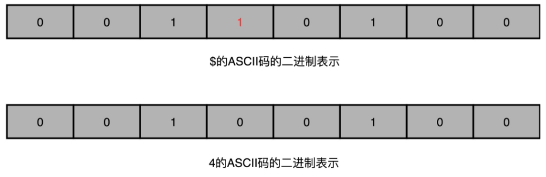
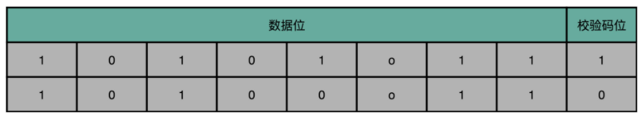

单比特翻转：无论是因为内存的制造质量造成的漏电，还是外部的射线，都有一定的概率，会造成单比特错误。比如 0011 0100 可能被翻转为0010 0100

奇偶校验和校验位：8 位就是一个字节。然后，用额外的一位去记录，这 8 个比特里面有奇数个 1 还是偶数个 1。如果是奇数个 1，那额外的一位就记录为 1；如果是偶数个 1，那额外的一位就记录成 0。那额外的一位，我们就称之为**校验码位**。

海明码
#ignore 