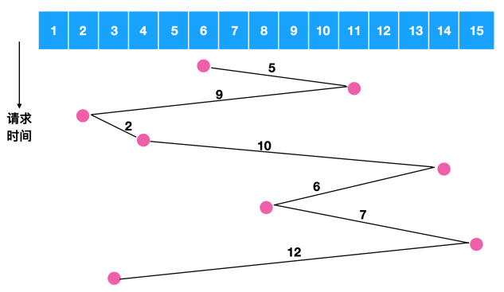
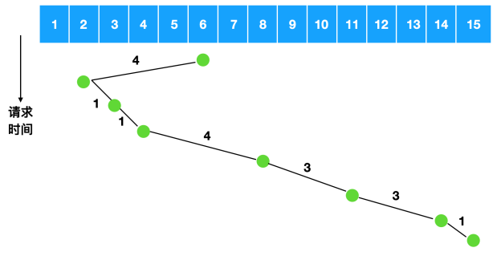
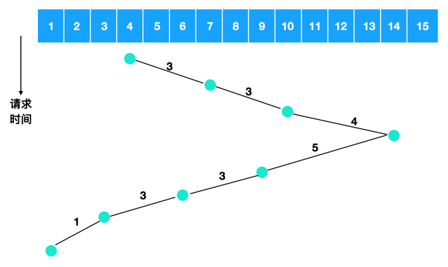

# 磁盘调度算法

读写一个磁盘块的时间的影响因素有：

- 旋转时间（主轴转动盘面，使得磁头移动到适当的扇区上）
- 寻道时间（制动手臂移动，使得磁头移动到适当的磁道上）
- 实际的数据传输时间

> 其中寻道时间最长，因此磁盘调度的主要目标是使磁盘的平均寻道时间最短。

1. 先来先服务(FCFS, First Come First Served)：按照磁盘请求的顺序进行调度。缺点：使平均寻道时间可能较长。

   

2. 最短寻道时间优先（SSTF, Shortest Seek Time First）：优先调度与当前磁头所在磁道距离最近的磁道。缺点：缺乏公平，容易出现饥饿现象

   

3. 电梯算法（SCAN）总是按一个方向来进行磁盘调度，直到该方向上没有未完成的磁盘请求，然后改变方向。

   

对于磁盘来说，最影响性能的就是寻道时间和旋转延迟，所以一次只读取一个或两个扇区的效率是非常低的。出于这个原因，许多磁盘控制器总是读出多个扇区并进行高速缓存，即使只请求一个扇区时也是这样。一般情况下读取一个扇区的同时会读取该扇区所在的磁道或者是所有剩余的扇区被读出，读出扇区的数量取决于控制器的高速缓存中有多少可用的空间。