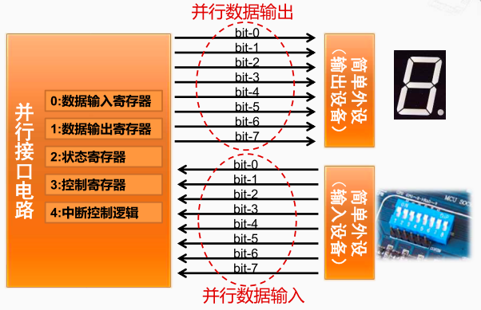
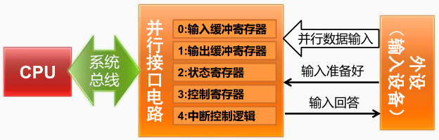
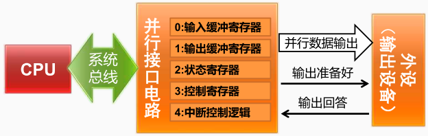

程序控制方式分为：无条件传送方式， 程序查询传送方式。

## 无条件传送方式
假定外设已经准备好，CPU 直接使用指令与外设传送数据，不查询外设的工作状态

## 程序查询方式

### 数据输入过程

1. 系统初始化时，CPU 执行指令，将控制字写入接口的“控制寄存器”，设置接口的工作模式
2. 外设将数据发到“并行数据输入”信号线上，并将“输入准备好”信号置为有效
3. 接口发现“输入准备好”信号有效后，从“并行数据输入”信号线上接收数据，放入“输入缓冲寄存器”，并将“输入回答”信号置为有效，阻止外设输入新数据
4. 接口将“状态寄存器”中的状态位“输入缓冲满”置为有效
5. 在上述过程中，CPU 反复执行指令从“状态寄存器”中读出状态字，直到发现“输入缓冲满”，然后执行指令从“输入缓冲寄存器”中读出数据
6. 接口将“输入回答”信号置为无效，等待外设输入新数据

### 数据输出过程

1. CPU 执行指令，将控制字写入接口的“控制寄存器”，从而设置接口的工作模式
2. CPU 执行指令，将数据写到接口的“输出缓冲寄存器”
3. 接口将数据发到“并行数据输出”信号线上，并将“输出准备好”信号置为有效（亦可由 CPU 写控制字将该信号置为有效）
4. 外设发现“输出准备好”信号有效后，从“并行数据输出”信号线上接收数据，并将“输出回答”信号置为有效
5. 接口发现“输出回答”信号有效后，将“状态寄存器”中的状态位“输出缓冲空”置为有效
6. 在这个过程中， CPU 反复执行指令从“状态寄存器”中读出状态字，直到发现“输出缓冲空”，然后开始下一个输出过程，继续输出新数据

> “握手（ Handshaking ）信号”：总是成对出现，在数据传送中起着定时协调与联络作用。采用“握手”方式的数据传送，每一过程必须都有应答，彼此进行确认。
