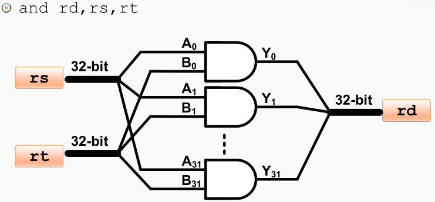

ALU 也就是算术逻辑单元，主要负责提供基本的算术运算和逻辑运算的功能。 

32位的and指令
首先，将32个与门并排连起来，
然后，将32位的输入分别连接到这32个与门上。 

> 假设寄存器rs中的32位操作每位分别用编号A0-A31标记，寄存器rt的操作数用B0-B31标记

[[多功能运算单元]]

[[加法与减法]]

[[乘法]]

[[除法]]

[[溢出与进位]]

[[移位运算]]