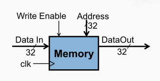

## 存储器
 一个只读的指令存储器，地址和数据均为 32 位， 一个可读写的数据存储器，地址和数据均为 32 位， 与CPU中的指令和数据高速缓存（Cache）对应。

数据接口信号：Data In ： 32 位的数据输入信号，Data Out ： 32 位的数据输出信号。

读写控制：存储器的读写实际上和寄存器堆类似，只要给入一个地址， 存储器就会将对应的存储单元中的数送到数据输出信号上。

Address ： 32 位的地址信号。该信号指定一个存储单元，将其内容送到数据输出信号
Write Enable ：写使能信号。在时钟信号（ clk ）的上升沿，如果写使能信号有效（为 1 ），将数据输入信号的内容存入地址信号指定存储单元

