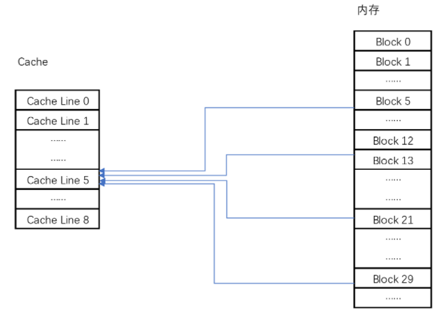
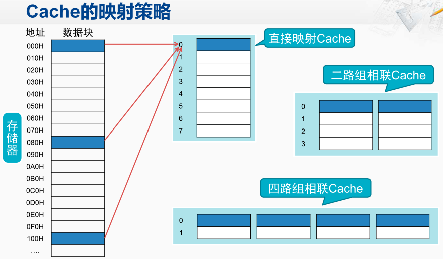

高速缓存的读取过程

现代 CPU 进行数据读取的时候，无论数据是否已经存储在 Cache 中，CPU 始终会首先访问 Cache。只有当 CPU 在 Cache 中找不到数据的时候，才会去访问内存。

缓存放置策略
包括全相连 Cache（Fully Associative Cache）、组相连 Cache（Set Associative Cache）、直接映射 Cache（Direct Mapped Cache）。

**直接映射 Cache**（Direct Mapped Cache）

直接映射 Cache，确保任何一个内存块的地址，始终映射到一个固定的 CPU Cache 地址（Cache Line）。

比如内存被分成 0～31 号这样 32 个块， CPU一共有 8 个缓存块。用户想要访问第 21 号内存块则只需要访问 5 号缓存块（21 mod 8 = 5）。

直接映射 Cache中CPU Cache 中读取数据的步骤

1. 根据内存地址计算在 Cache 中的索引；
2. 判断有效位，确认 Cache 中的数据是有效的；
3. 对比内存访问地址的高位，和 Cache 中的组标记，确认 Cache 中的数据就是要访问的内存数据。
4. 如果CPU Cache 中的数据并不是要访问的内存地址的数据，那 CPU 就会访问内存，并把对应的 Block Data 更新到 Cache Line 中，同时更新对应的有效位和组标记的数据。
4. 根据内存地址的 Offset 位，从 Data Block 中，读取希望读取到的字。

组相联

组相联是指，将直接映射的Cache 分为多组，用于存放相同被映射到同一行Cache Line的多个存储地址对应的数据。
假设地址为000H和080H的通过直接映射到同一个CPU 的Cache地址。
此时如果采用二路组相联则将000H的数据映射完到CPU Cache地址后，接下来如果需要映射080H的数据则会把对应的数据块放在并排的位置，从而实现同时缓存的效果。
二路组相联可以扩展为三组相联，四组相联，以及全相联。

