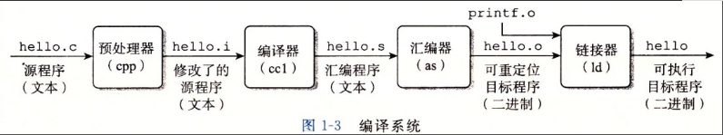

# 编译系统


以下是一个 hello.c 程序：

```c
#include <stdio.h>

int main()
{
    printf("hello, world\n");
    return 0;
}
```

在 Unix 系统上，由编译器把源文件转换为目标文件。

```bash
gcc -o hello hello.c
```

这个过程大致如下：



- 预处理阶段：处理以 # 开头的预处理命令；
- 编译阶段：翻译成汇编文件；
- 汇编阶段：将汇编文件翻译成可重定位目标文件；
- 链接阶段：将可重定位目标文件和 printf.o 等单独预编译好的目标文件进行合并，得到最终的可执行目标文件。

C 语言源代码通过编译器编译成汇编代码，然后汇编代码再通过汇编器变成 CPU 可以理解的机器码。

第一部分，源代码通过通过编译（Compile）器、汇编（Assemble）器以及链接（Link）器后产生可执行文件。

第二部分，可执行代码通过装载器（Loader）装载（Load）到内存中，从而转换成CPU可以识别的指令和数据


[[ELF文件]]
[[静态链接]]
[[动态链接]]
