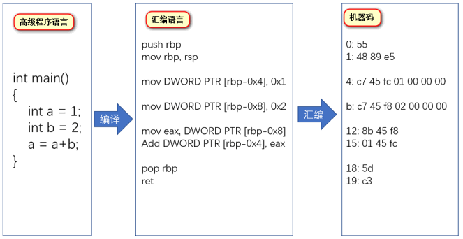
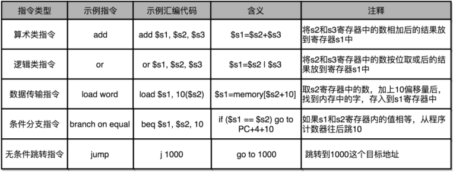
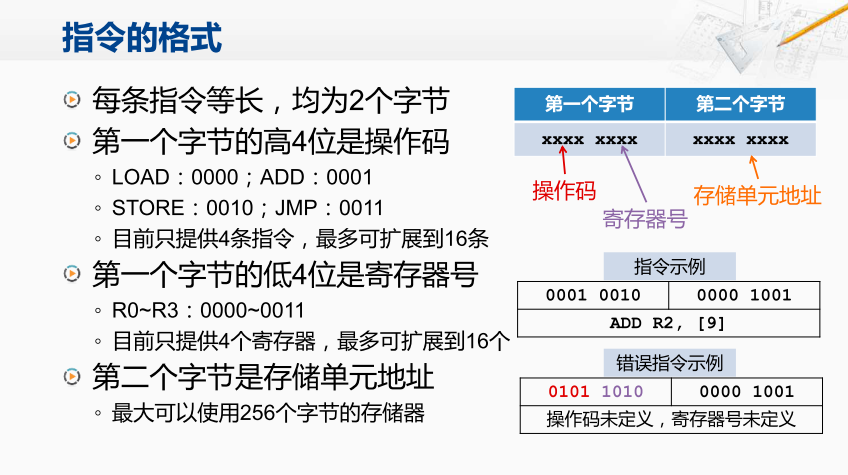

## 指令的生成

1. 编译：把整个程序翻译成一个**汇编语言**（ASM，Assembly Language）的程序
2. 翻译：编代码通过汇编器（Assembler）翻译成机器码（Machine Code）

## 指令的分类

**算术类指令**。加减乘除，在 CPU 层面都会变成一条条算术类指令。

**数据传输类指令**。给变量赋值、在内存里读写数据，用的都是数据传输类指令。

**逻辑类指令**。逻辑上的与或非，都是这一类指令。

**条件分支类指令**。“if/else”，其实都是条件分支类指令。

**无条件跳转指令**。在调用函数的时候，其实就是发起了一个无条件跳转指令。

## 指令格式

首先约定每条指令都是等长且为两个字节，

其次取第一个字节的高四位作为操作码，确定操作类型

然后取第一个字节的低四位作为寄存器号，

最后取第二个字节作为存储单元的地址

[[x86指令系统]]

[[MIPS指令系统]]

[[应用程序的性能评估]]