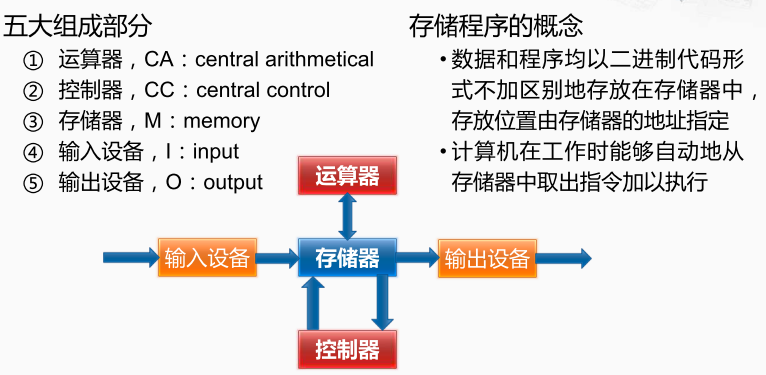

冯·诺依曼计算机的主要构成， 包括运算器CA，控制器CC，存储器M，输入设备I，和输出设备O，及外部记录介质R。

**控制器**：控制指令的执行过程

**运算器** ALU（Arithmetic Logic Unit/ ALU）：理解数据在计算机里的二进制表示，以及怎么从数字电路层面，实现加法、乘法这些基本的运算功能的。

**存储器**： CPU 高速缓存、内存

**输入输出设备**：键盘、鼠标、显示器等

> 鼠标、键盘以及硬盘都插在主板上作为外部 I/O 设备，通过主板上的**南桥**（South Bridge）芯片组和 CPU 之间的通信的。

总线可以分为三类

1. 数据线（Data Bus），用来传输实际的数据信息
2. 地址线（Address Bus），用来确定到底把数据传输到哪里去，是内存的某个位置，还是某一个 I/O 设备。
3. 控制线（Control Bus），用来控制对于总线的访问。

[[南北桥结构的演变]]

[[模型机]]

[[计算机指令]]

[[输入和输出]]

[[存储器]]

[[CPU-运算器与控制器]]

[[计算机启动过程]]

[[操作系统]]

学习方法：**学会提问自己来串联知识点**。学完一个知识点之后可以从下面两个方面，问一下自己。

- 我写的程序，是怎样从输入的代码，变成运行的程序，并得到最终结果的？
- 整个过程中，计算器层面到底经历了哪些步骤，有哪些地方是可以优化的？

课程推荐:计算机组成中，硬件层面的基础实现，比如寄存器、ALU 这些电路。

Coursera 上的北京大学免费公开课[Computer Organization](https://www.coursera.org/learn/jisuanji-zucheng)

CSAPP 的经典教材：（[Bilibili 版](https://www.bilibili.com/video/av24540152/)和[Youtube 版](https://www.youtube.com/playlist?list=PLmBgoRqEQCWy58EIwLSWwMPfkwLOLRM5R) ）。

操作系统（https://study.163.com/series/1202806603.htm） 
计算机组成原理分为：计算机的基本组成、计算机的指令和计算、处理器设计，以及存储器和 I/O 设备。