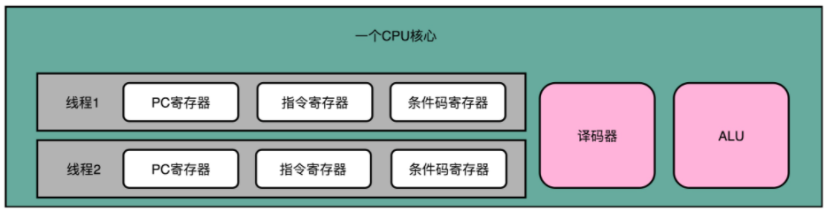
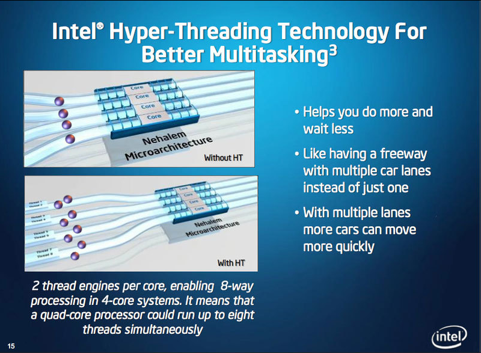

超线程技术

**超线程**（Hyper-Threading）技术： 使得在线程A指令在流水线停顿时可以执行线程B的指令。
通过在硬件层面增加电路（包括双份的 PC 寄存器、指令寄存器乃至条件码寄存器。），使得可以在一个 CPU 核心内部，维护两个不同线程的指令的状态信息。从而将一个物理 CPU 核心，“伪装”成两个逻辑层面的 CPU 核心。

由于 CPU 同时运行那些在代码层面有前后依赖关系的指令，会遇到各种冒险问题。但其他进程中的指令相对当前进程而言完全独立，因此可以独立运行。

