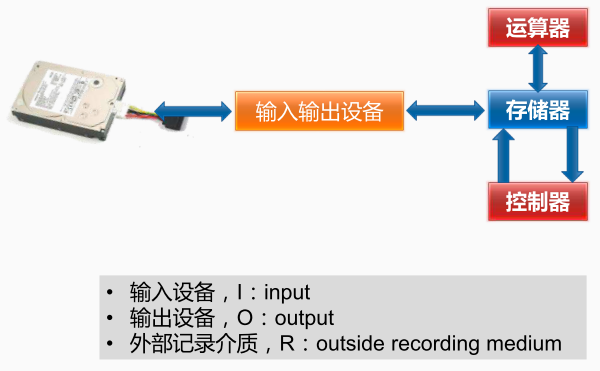
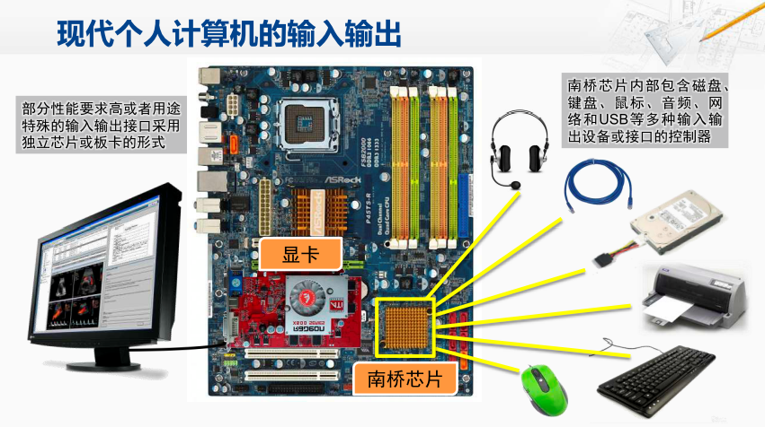
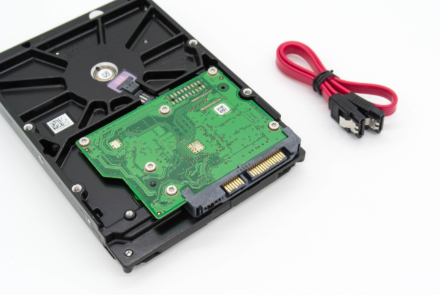

在冯诺依曼结构体系结构中，输入输出设备可以连接外部记录介质

在现在的个人计算机当中，大多数的输入输出设备的控制芯片都会集中在主板上的南桥芯片中，比如鼠标、键盘等。一些比较复杂的输入输出的需求，则通过独立的芯片与外部的设备进行相连，比如高性能的显示。 

输入输出设备与CPU的连接

输入输出设备包括**接口**（Interface）和**实际的 I/O 设备**（Actual I/O Device）两部分。

> 上图为SATA 硬盘，整个绿色电路板和黄色的齿状部分就是接口电路，黄色齿状的就是和主板对接的接口，绿色的电路板就是控制电路

[[输入输出接口-IO接口]]

[[HDD磁盘]]

[[硬件估算]]

[[硬件错误的发现与纠错]]