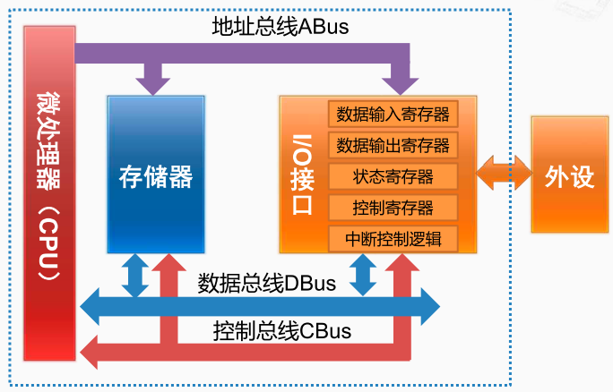

IO接口通过总线与CPU 通信，主要用于中转或管理不同类型的输入输出设备。接口电路中包含响应的状态寄存器（Status Register）、 命令寄存器（Command Register）、数据寄存器（Data Register）、数据缓冲区和设备内存等等。

输入输出接口（ I/O 接口）的基本功能

1. 数据缓冲，解决 CPU 和外设之间的速度差距
2. 提供联络信息，协调与同步数据交换过程， 比如打印机什么时候能够接收数据
3. 信号与信息格式的转换，比如模拟信号和数字信号之间的转换， 串行信号和并行信号之间的转换，不同电平之间的转换。 
4. 设备选择，一个接口可能连接了多个设备，比如说有多个硬盘，
5. 中断管理
6. 可编程功能

[[输入输出接口的编址方式]]

[[X86的 IO 指令]]
