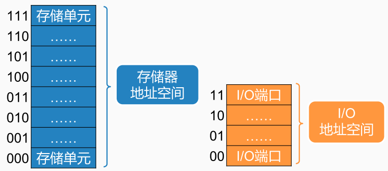
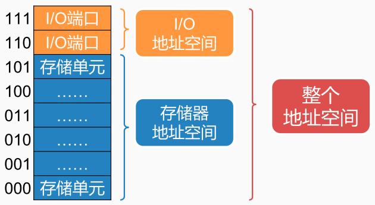
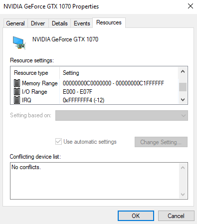

输入输出接口的编址方式
1. I/O 端口和存储器分开编址，I/O 映像的 I/O 方式， I/O Mapped I/O，X86。需要单独指令

2. I/O 端口和存储器统一编址，存储器映像的 I/O 方式， Memory Mapped I/O，MIPS。可以复用存储器的指令

显卡在Windows设备管理器里面的资源（Resource）信息Memory Range，MMIO，设备对应映射到的内存地址。
I/O Range，PMIO，也就是通过端口来访问 I/O 设备的地址。IRQ，来自于这个设备的中断信号

