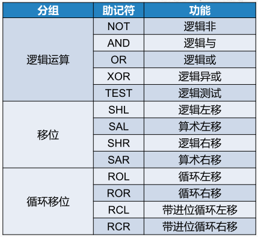
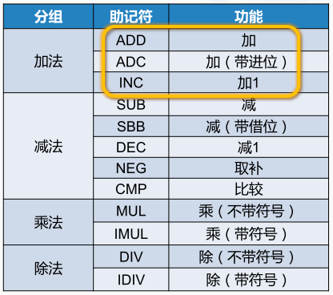
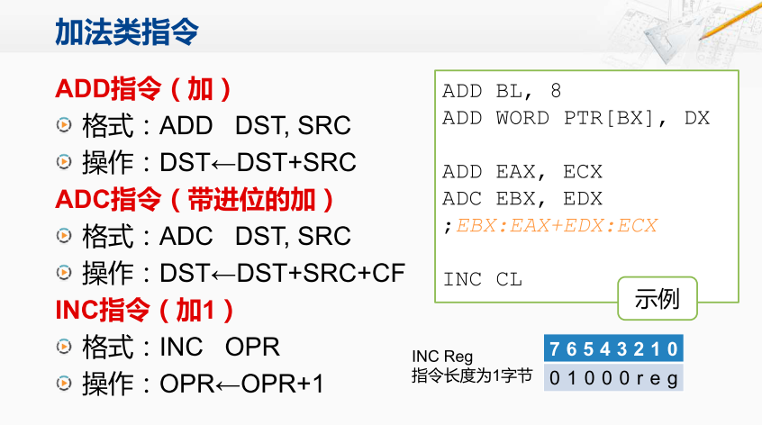

运算类指令：包括逻辑运算指令，移位指令，算术运算指令。

逻辑运算和移位指令：实现对二进制位的操作和控制。 又称“位操作指令”。操作数的限制：对于单操作数指令，操作数不能是立即数。对于双操作数指令，限制与MOV 指令相同

算术运算指令：完成加、减、乘、除等算术运算。 提供运算结果调整、符号扩展等功能。操作数的限制：目的操作数不能是立即数或 CS寄存器，两个操作数不能同时为存储器操作数

加法类指令

ADD指令，有两个操作数，所做的操作是将这两个操作数中的内容相加，并将结果存放到第一个操作数当中去。

INC指令，只有一个操作数，将这个操作数加1。

ADC指令，带进位的加法，它的加法运算是将这两个操作数相加，再加上CF标志位，运算的结果放回到第一个操作数中去。

> ADD指令会用到ALU，如果这个加法运算产生了进位，就会去改写标志寄存器当中的CF位。
>
> 而如果当前执行的是ADC指令，那标志寄存器当中的 CF位也会被送到ALU参与运算，这样之前的运算指令的结果实际就影响了现在这条加法指令。
>
> 因此ADD指令和ADC指令都会根据自己的运算结果来改变标志寄存器当中的CF位。而ADC指令还会将CF标志位的值加入到运算当中。

