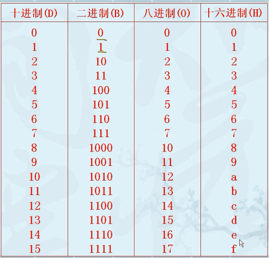
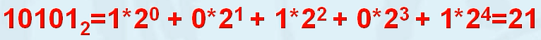
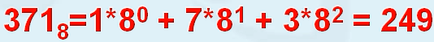
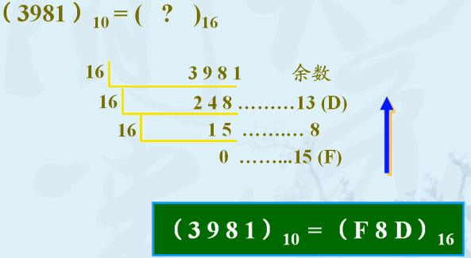
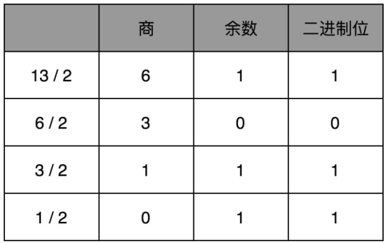

二进制转十进制

8进制转十进制

16进制转十进制

十进制转N进制

**短除法**：十进制数除以 N 的余数，作为最右边的一位。然后用商继续除以 N，把对应的余数紧靠着刚才余数的右侧，这样递归迭代，直到商为 0 

原码、反码、补码是机器存储一个具体数字的编码方式。

原码：原码就是符号位加上真值的绝对值，即用第一位表示符号，其余位表示值。
存储的值是一个环，从0000 0000开始，到0111 1111为最大正数值，再加1为1000 0000为最小负数值

反码: 正数的反码是其本身。负数的反码是在其原码的基础上，符号位不变，其余各个位取反。

补码: 正数的补码就是其本身。负数的补码是在其正数原码的基础上，其余各位取反，最后 + 1 (即在反码的基础上 + 1)。 `-x = (~x) + 1`

[[浮点数]]