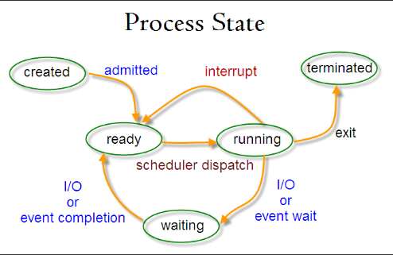

## 进程状态的切换

- 就绪状态（ready）：就绪态指的是可运行，但因为其他进程正在运行而处于就绪状态
- 运行状态（running）：运行态指的就是进程实际占用CPU时间片运行时
- 阻塞状态（waiting）：除非某种外部事件发生，否则进程不能运行

从运行状态到阻塞状态，进程因为等待输入而阻塞
从运行状态到就绪状态，调度程序选择另一个进程
从就绪到运行状态，调度程序选择一个进程开始运行
从阻塞到就绪状态，出现有效的输入

> 程序调度指决定哪个进程优先被运行和运行多久