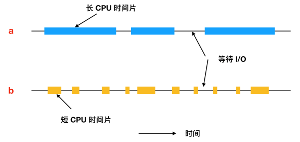

依据CPU的占用时间可以将进程分为两类：CPU密集型(CPU-bound) 或I/O密集型(I/O-bound)。

CPU密集型进程有较长的CPU集中使用和较小频度的I/O等待，进程A

I/O密集型进程有较短的CPU使用时间和较频繁的I/O等待， 进程B

> 几乎所有的进程(磁盘或网络)I/O请求和计算都是交替运行的，即CPU不停顿的运行一段时间，然后发出一个系统调用等待I/O读写文件。完成系统调用后，CPU又开始计算，直到它需要读更多的数据或者写入更多的数据为止。

