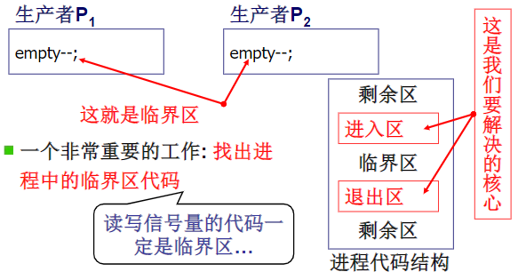

进程间的通信是指多个进程协同的过程。

临界区(critical section)：对共享内存进行访问的程序片段。如果能使两个进程不可能同时处于临界区就能避免竞态条件。

> 竞态条件(race condition)：两个或多个线程同时对一共享数据进行修改。

临界区代码的保护原则：

1. 互斥进入，如果一个进程在临界区中执行，其他进程就不允许进入
2. 有空让进，若干进程要求进入空闲临界区时，应尽快使一进程进入临界区
3. 有限等待，从进程发出进入请求到运行进入，不能无限等待

> 互斥条件（mutual exclusion condition）： 如果一个进程在某种方式下使用共享变量和文件的话，除该进程之外的其他进程就禁止做这种事(访问统一资源)

[[忙等互斥]]

[[信号量]]

[[屏障]]

[[死锁]]

