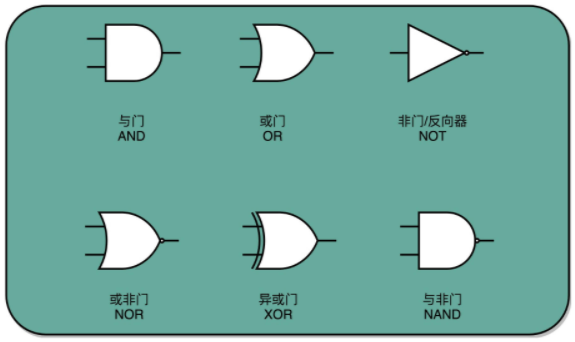

## 门电路

门电路：计算机硬件层面通过电路设计最基本的单元。基础的门电路包括：与（AND）或（OR）NOT（非）和异或（XOR）

与：and -> 有0出0,全1出1 例如：`1,1–>1` `1,0–>0` `0,1–>0` `0,0–>0`

或：or -> 有1出1,全0出0 例如：`1,1–>1` `1,0–>1` `0,1–>1` `0,0–>0`

非：not ->有1出0,有0出1 例如：`1->0` `0–>1`

与非：nand -> 先按与的操作,然后结果取反 例如：`1,1–>0` `1,0–>1` `0,1–>1` `0,0–>1`

或非：nor -> 先按或的操作,然后结果取反 例如：`1,1–>0`  `1,0–>0` `0,1–>0` `0,0–>1`

异或：xor  ->  相异为1,相同为0     例如：`1,1->0`     `1,0->1`    `0,1->1`    `0,0->0`

同或：xnor  -> 相同为1,相异为0    例如：`1,1->1`     `1,0->0`    `0,1->0`    `0,0->1`

[[异或门]]

[[或门]]

[[与门]]

[[非门]]

