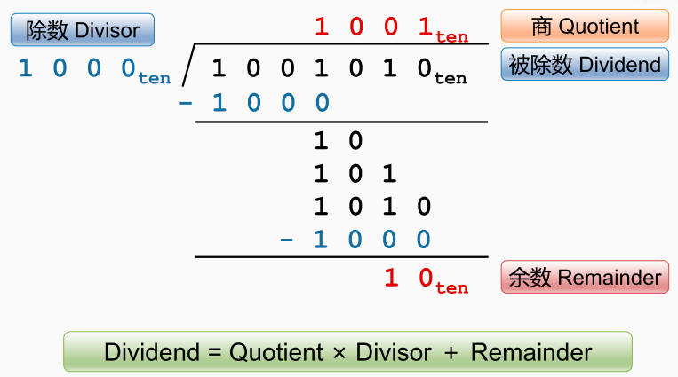

除法的运算过程

选择两个十进制的数， 被除数是1001010， 除数是1000

首先将除数和被除数，从高位开始对齐，然后将对齐的这部分进行一个减法，如果结果是一个正数，即够减的时候，就在上面标一个1， 然后把减完的差放在下面，
然后再从被除数后面的位拿一个数下来， 然后检查是否够减除数，如果不够则在上面标一个0， 
然后再多拿一位，依旧检查是否够减除数，如果不够继续再上面标一个0，
然后再拿一位，继续检查是否够减除数，如果够减则在上面标一个1。

接着执行减法，减完的结果已经比除数小了，而且被除数那里也没有多余的位可以拿下来继续运算，因此这个除法就已经完成。 
此时最上面的这个数是除法运算的商， 而最下面的这个数为余数。因此 `被除数 = 商 * 除数 + 余数。`

[[除法器]]

[[除法器的工作流程]]