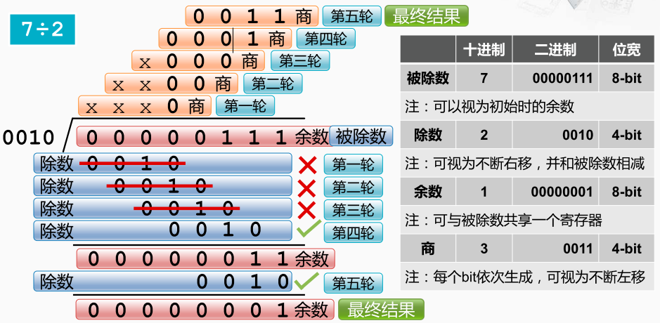
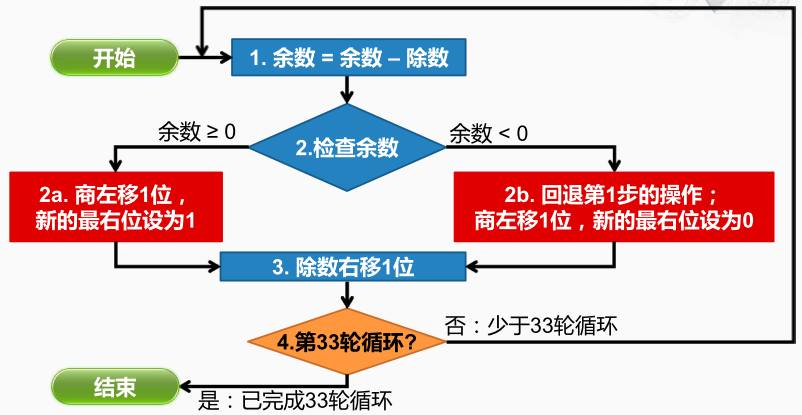
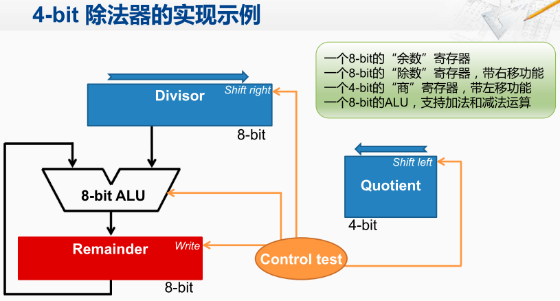

除法器

设计一个硬件的除法器，即从硬件实现的角度出发，来考虑如何描述除法的运算过程。 

首先，对于硬件实现需要确定运算的操作数的宽度。在除法当中约定，如果被除数是 `N` 位宽，则除数和商都约定为`N/2`位宽。 因此被除数8位宽，而除数4位宽。 
被除数， `00000111`，即十进制的7，用8个比特来表示，而且被除数可以视为初始化时候的余数 
除数，`0010`，即十进制的2，用4个比特来表示，在运算的过程中，可以看作将除数不断地右移，并和被除数进行相减。 
余数，与被除数共享一个寄存器，因此也用8个比特来表示。 
商，在运算过程中，它的每一个比特是从高到低，也就是从左往右依次生成的，可以视为不断地左移而形成，用4个比特的寄存器来保存。 

除法器的工作流程
首先进行初始化工作，然后进入正式的工作步骤。
第1步，用余数寄存器的内容减去除数寄存器中的内容，并将结果保存到余数寄存器当中； 
第2步，检查余数寄存器的内容：
    如果当前的余数大于等于0，则执行 2a分支，将商寄存器中的内容左移一位，并将空出的最右边这位设为1；
    如果当前的余数小于0，则执行 2b 分支，回退第1步的减法操作。然后将商寄存器左移一位，但是空出来的最右位是设为0；

第3步，将除数寄存器右移一位
第4步，判断当前是否为最后一轮循环。 如果除数是 `N` 位的，那么一共要进行`N + 1`轮循环， 
    如果不到 `N + 1` 轮循环，那就回到第1步继续执行；
    如果已经是 `N + 1` 轮循环，说明运算已经完成， 最终结果存放在当前的商寄存器和余数寄存器当中。 

4位的除法器
4位的除法器组件包括：
    8位的余数寄存器。
    8位的除数寄存器，而且带右移的功能。 
    4位的商寄存器，带左移的功能。
    8位的ALU，支持加法和减法运算。 ALU的输入来自除数寄存器和余数寄存器，且输出连余数寄存器。 
    控制逻辑，控制这几个寄存器和ALU的工作

