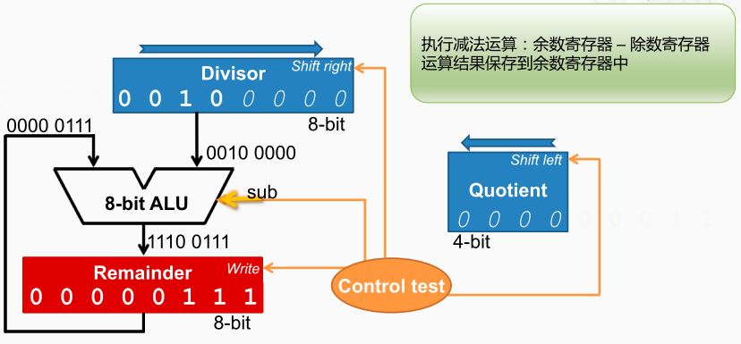

除法器的工作过程
首先是初始化工作。将8位的被除数放入”余数“寄存器， 然后将4位的除数放入”除数“寄存器的高4位， 并将”除数“寄存器的低4位补上0， 将4位的”商“寄存器置为0。

第1步，执行减法运算，将当前余数寄存器的内容，减去除数寄存器的内容。 
    控制逻辑会向ALU发出执行减法的控制信号， ALU将输入的两个数进行减法运算。此时除数寄存器保存的是`00100000`， 而余数寄存器保存的是`00000111`。 因此减法的结果是`11100111`。 
    控制逻辑还会向余数寄存器发出要写入的控制信号，在下一个时钟上升沿到来的时候，ALU的输出就会保存到余数寄存器当中。 

第2步，检查余数寄存器，如果大于等于0，则执行2a这个分支的操作； 如果小于0，则执行2b这个分支的操作； 通过检查余数寄存器的最高位，如果最高位为1，则代表这个数小于零。
    由于结果`11100111`小于0，则要回退第一步的操作，把余数寄存器的内容加上 除数寄存器的内容。
    控制逻辑会给出执行加法的控制信号， 通过ALU得到运算结果。 
    控制逻辑还会给出，让余数寄存器写入的控制信号，然后等到下一个时钟上升沿到来的时候，余数寄存器就把这个值保存进去。 
    然后商寄存器要左移一位，并将新的最右位设为0

第3步，将除数寄存器的内容右移一位，最左边会补入一个0，最右边移出的数就直接丢掉。

第4步，检查这是不是最后一轮循环，检查当前是不是第5轮循环。目前还不是第5轮循环，所以还需要继续除法器的工作。 

接着依次进入第2、3、4、5轮，之后最终的结果如下

除法的优化

