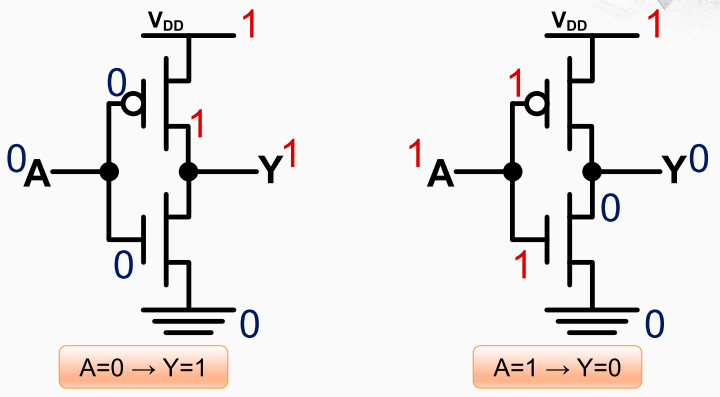

非门

> 非门原理图中 $V_{DD}$ 表示电源即高电平，通常用`1`表示，3条横线表示地即低电平，通常用0来表示

逻辑符号，a是输入，y是输出， 中间用一个三角再加上一个小圆圈构成。 真值表列出了在各种输入情况下输出应该是怎么样的。 

非门的工作过程

当a为0时，对于PMOS晶体管的gate端而言为导通状态，因此电源这一端的1 会传到Y。对于NMOS晶体管的gate端而言为关闭状态，因此低电平无法通过晶体管传到到Y，因此Y最终输出1。

a等于1时恰好与之相反，Y最终输出0。

