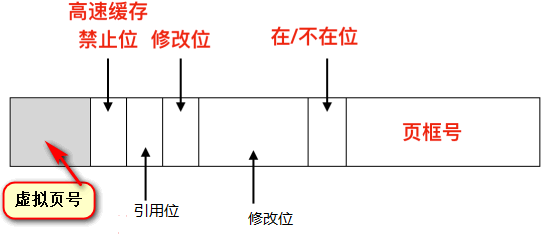

页表：存放虚拟地址到内存物理地址的映射关系。

虚拟页号：通过虚拟地址推导，虚拟地址除以每页大小的商

高速缓存禁止位：表示是否禁用高速缓存

引用位(Referenced)：在页面被引用时被设置包括读和写。

修改位(Modified)：当一个页面被写入时硬件会自动的设置修改位。
> 如果一个页面已经被修改过（即是脏的），则必须把写回磁盘。如果一个页面没有被修改过(即是干净的)，在重新分配时这个页框可以被直接丢弃。

保护位(Protection)：0 表示可读可写，1表示的是只读。

在/不在位：1 表示页表项是有效的并且能够被使用。0 表示该页表项对应的虚拟页面不在内存中，访问该页面会引起一个缺页异常(page fault)。

页框号(Page frame number)：物理内存的地址块编号，类似数组的索引下标

[[多级页表]]

[[地址转换高速缓冲-TLB]]

