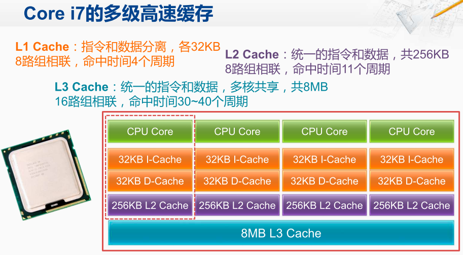

```java
int[] arr = new int[64 * 1024 * 1024];
 
// 循环 1
for (int i = 0; i < arr.length; i++) arr[i] *= 3;
 
// 循环 2
for (int i = 0; i < arr.length; i += 16) arr[i] *= 3
```

结论：按道理来说，循环 2 只访问循环 1 中 1/16 的数组元素，只进行了循环 1 中 1/16 的乘法计算，那循环 2 花费的时间应该是循环 1 的 1/16 左右。但是实际上，循环 1 在我的电脑上运行需要 50 毫秒，循环 2 只需要 46 毫秒。这两个循环花费时间之差在 15% 之内。

原因：

在我们日常使用的 Intel 服务器或者 PC 里，Cache Line 的大小通常是 64 字节。而在上面的循环 2 里面，我们每隔 16 个整型数计算一次，16 个整型数正好是 64 个字节。于是，循环 1 和循环 2，需要把同样数量的 Cache Line 数据从内存中读取到 CPU Cache 中，最终两个程序花费的时间就差别不大了。

