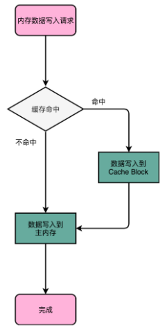
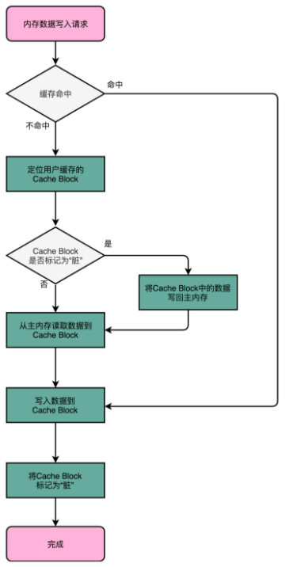
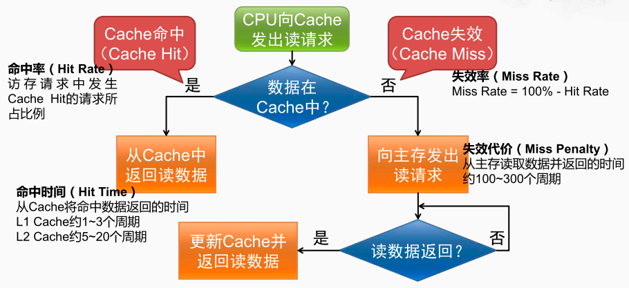

CPU写入策略

写穿透（Write-Through）

写入前先判断数据是否已经在 Cache 里面了。如果数据已经在 Cache 里面了，先把数据写入更新到 Cache 里面，再写入到主内存里面；
如果数据不在 Cache 里就只更新主内存。

> 效率低下。由于CPU Cache 比内存的读写效率高很多，因此每次都要等数据写入内存则CPU cache将失去优势

写回（Write-Back）
如果发现要写入的数据，就在 CPU Cache 里面，那么就只是更新 CPU Cache 里面的数据。同时标记 CPU Cache 里的这个 Block 是脏（Dirty）的。

> 所谓脏的，就是指这个时候，我们的 CPU Cache 里面的这个 Block 的数据，和主内存是不一致的。

如果发现要写入的数据所对应的 Cache Block 里，放的是别的内存地址的数据，则进一步检查 Cache Block 里面的数据是否被标记成脏的。

如果是脏的话，则要先把这个 Cache Block 里面的数据，写入到主内存里面。然后，再把当前要写入的数据，写入到 Cache 里，同时把 Cache Block 标记成脏的。

如果 Block 里面的数据没有被标记成脏的，那么直接把数据写入到 Cache 里面，然后再把 Cache Block 标记成脏的。

Cache 命中时的写策略
1. 写穿透（ Write Through ）：数据同时写入 Cache 和主存
1. 写返回（ Write Back ）：数据只写入 Cache ，仅当该数据块被替换时才将数据写回主存“ Cache 失效”时的写策略

Cache 失效时的写策略
1. 写不分配（ Write Non-Allocate ）：直接将数据写入主存
1. 写分配（ Write Allocate ）：将该数据所在的块读入 Cache 后，再将数据写入 Cache

